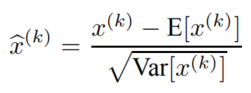
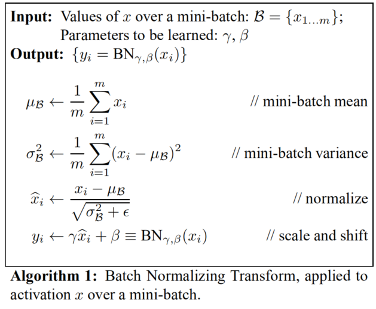
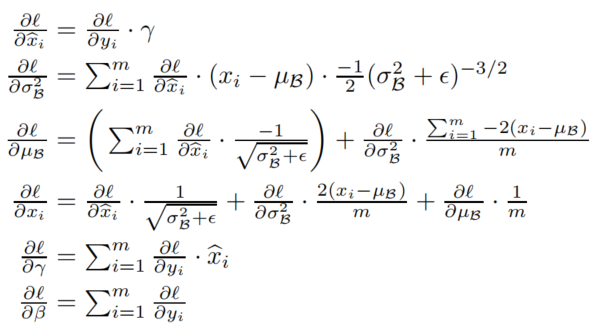
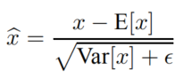
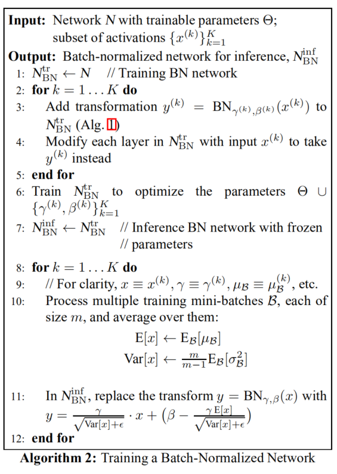
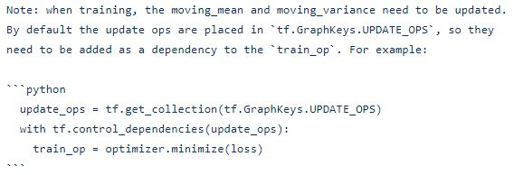

<b>Batch Normalization</b>

##### BN 提出的动机
Batch Normalization 的提出是为了解决内部方差偏移（internal covariate shift,ICS）的问题。 论文：[Batch Normalization: Accelerating Deep Network Training by Reducing Internal Covariate Shift](resource/BatchNormalization/BatchNormalization.pdf)
ICS是指神经网络种前面层的参数变化导致后面层的输入发生变化。
ICS使得模型训练需要使用较小的学习率和精细的参数初始化，从而减慢模型训练速度。并且使得训练具有饱和非线性得模型变得非常困难。

##### BN 的效果
* 加速模型的训练（缓解梯度消失，支持更大的学习率）
* 降低参数初始化的要求
* 有正则化效果减少过拟合
  
##### 原理
* BN会针对**每一批训练数据**，在网络的**每一层输入**之前做**归一化**处理，使输入的均值为0，标准差为1。目的是将**数据**限制在统一的**分布**下。
* 具体来说，针对每层的第 k 个神经元，计算这一批数据在第 k 个神经元的均值与标准差，然后将**归一化**后的值作为该神经元的激活值。
  
* BN 可以看作在各层之间加入了一个新的计算层，**对数据分布进行额外的约束**。
* **梯度优化算法需要参与到BN中，否则BN和梯度优化的作用会相互抵消**，导致loss不变，权重一直更新变成无穷大。[作者在论文第2节花了比较大的篇幅讨论这个问题] 直接将BN加入到优化算法会增加很多计算量，因为要计算层输入的协方差矩阵及其平方根。所以作者引入了一对可训练参数$\gamma^{(k)}$，$\beta^{(k)}$，用来缩放平移归一化后的值：$y^{(k)}=\gamma^{(k)} \widehat{x}^{(k)}+\beta^{(k)}$。这组参数也使得模型具有恢复原输入的能力。（有很多文章讲到这两个参数时都说是“为了恢复原输入”，这显然是不对的。）
  
##### 训练时的计算过程：

反向传播参数更新：

##### 推理时的计算过程：
训练时BN的计算不仅依赖当前输入$x_i$还依赖当前mini-batch，测试推理时为了保证只依赖当前输入采用下面的方式计算BN：

其中， $\mathrm{E}[x]$ 和 $\operatorname{Var}[x]$ （我们叫全局统计量）在训练过程中由mini-batch的均值和方差通过移动平均计算得到，训练完成后保存在模型中。Using moving averages instead, we can track the accuracy of a model as it trains.

##### 相关问题

* **为什么训练时不用全局统计量?**
  1、使用BN的目的就是为了保证每批数据的分布稳定，使用全局统计量潍坊了这个初衷。
  2、作者认为在训练时使用全局统计量可能会与梯度优化相互抵消:
  >It is natural to ask whether we could simply use the moving averages µ, σ to perform the normalization during training, since this would remove the dependence of the normalized activations on the other example in the minibatch. This, however, has been observed to lead to the model blowing up. As argued in [6], such use of moving averages would cause the gradient optimization and the normalization to counteract each other. For example, the gradient step may increase a bias or scale the convolutional weights, in spite of the fact that the normalization would cancel the effect of these changes on the loss. This would result in unbounded growth of model parameters without actually improving the loss. It is thus crucial to use the minibatch moments, and to backpropagate through them.

  出自[Batch Renormalization: Towards Reducing Minibatch Dependence in Batch-Normalized Models](resource/BatchNormalization/BatchRenormalization.pdf)

* **为什么mini-batch太小时，BN会失效？**
  因为训练时BN依赖mini-batch中的其他样例，并且训练和推理时的激活指不同。作者原话：
  >We hypothesize that this is due to the dependence of model layer inputs on all the examples in the minibatch, and different activations being produced between training and inference.

  作者由此引出了 Batch Renormalization。
  batch-size较小时使用 Batch Renormalization会有更好的效果。

##### How Does Batch Normalization Help Optimization?
BN的效果虽然很好，但是作用原理受到了质疑。MIT的研究者在论文[How Does Batch Normalization Help Optimization?](resource/BatchNormalization/How-Does-Batch-Normalization-Help-Optimization.pdf)中表明 BN 和 ICS 无关。
论文提出：
（1）BN 和 ICS 无关
（2）BN 不能降低 ICS
那么 BN 为什么有效？
作者指出，BN 能够使优化空间（loss landscape）变得更平滑。
>Indeed, we identify the key impact that BatchNorm has on the training process: it reparametrized the underlying optimization problem to make its landscape significantly more smooth.

就像这样：

##### 使用 BN 需要注意的地方：
1、batch-size不能太小，如果需要小batch，使用 Batch Renormalization。
2、训练数据要打乱，混合均匀。
>每当单个小批次(minibatch)的数据不能代表整个数据的分布时，都会遇到这样的问题。这就意味着忘记将输入随机打乱顺序的情况下使用批归一化是很危险的。这在最近流行的生成对抗网络(GAN)里也是非常重要的。GAN中的判别器通常是对假数据和真实数据的混合进行训练。如果在判别器中使用了批归一化，在纯假数据的批次或纯真实数据批次之间进行交替是不正确的。每个小批次需要是两者的均匀混合(各 50%)。

详见[深度学习中批归一化的陷阱](http://ai.51cto.com/art/201705/540230.htm)

##### 用法
1、如果在Tensorflow中使用 BN，需要在训练时加上下面的代码：

2、如果在Caffe中使用 BN，需要在推理时指定参数`use_global_stats:true`，训练时指定 `false`（默认就是 `false`）。

**参考**
[1] [Batch Normalization: Accelerating Deep Network Training by Reducing Internal Covariate Shift](resource/BatchNormalization/BatchNormalization.pdf)

[2] https://github.com/imhuay/Algorithm_Interview_Notes-Chinese/blob/master/A-%E6%B7%B1%E5%BA%A6%E5%AD%A6%E4%B9%A0/A-%E6%B7%B1%E5%BA%A6%E5%AD%A6%E4%B9%A0%E5%9F%BA%E7%A1%80.md#%E6%AD%A3%E5%88%99%E5%8C%96

[3] http://www.caffecn.cn/?/question/165

[4] [Batch Renormalization: Towards Reducing Minibatch Dependence in Batch-Normalized Models](resource/BatchNormalization/BatchRenormalization.pdf)

[5] [How Does Batch Normalization Help Optimization?](resource/BatchNormalization/How-Does-Batch-Normalization-Help-Optimization.pdf)

[6] [[论文阅读]How Does Batch Normalization Help Optimizati](https://zhuanlan.zhihu.com/p/52132614)

[7] [深度学习中批归一化的陷阱](http://ai.51cto.com/art/201705/540230.htm)