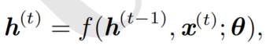
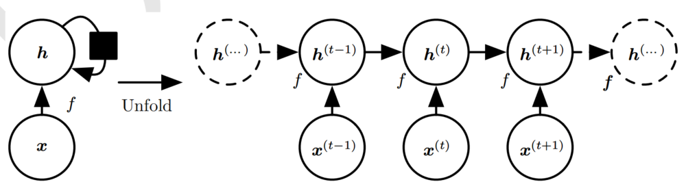
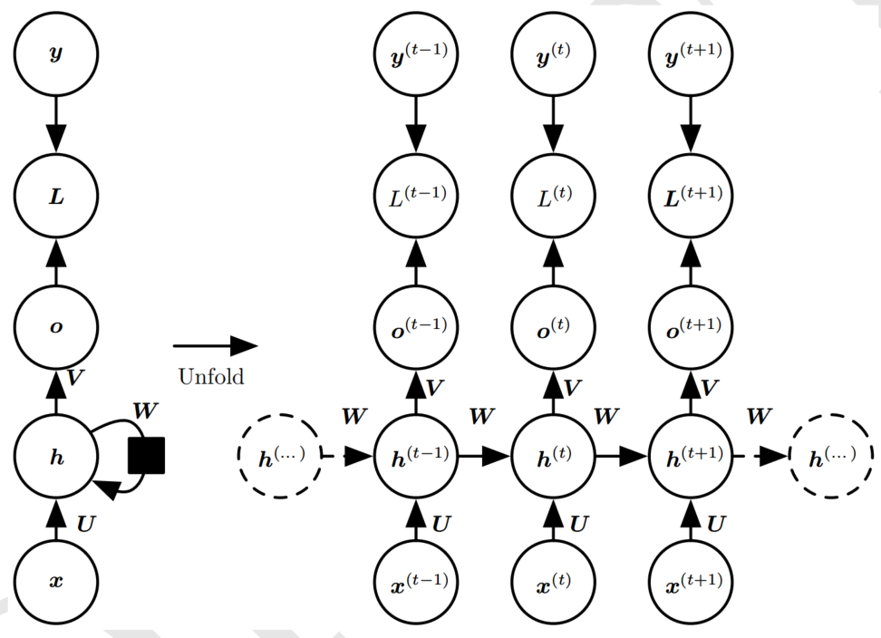
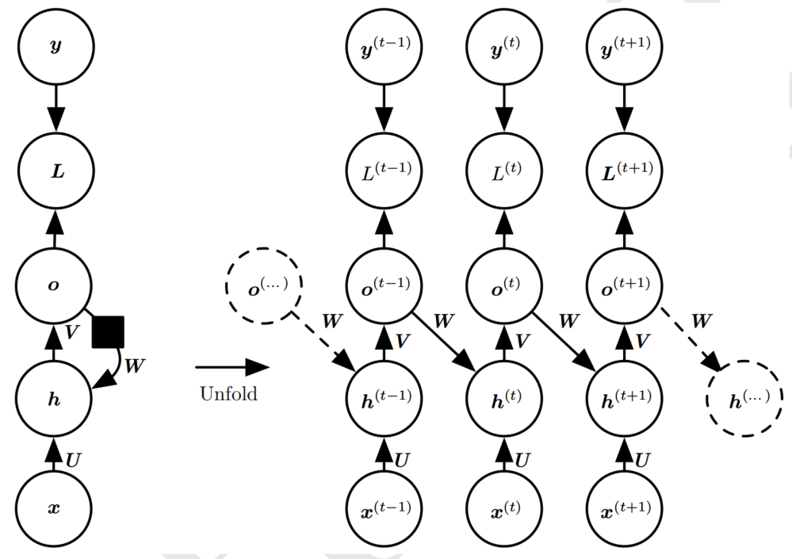
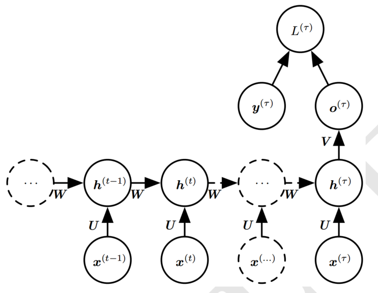

<b>循环神经网络</b>

* [一、RNN概述](#introduction)
* [二、RNN的结构](#structure)
* [三、RNN的前向传播](#forward)
* [四、RNN的反向传播](#backward)
* [五、RNN的梯度消失与爆炸](#gradient)
  

<b>一、RNN概述</b>

循环神经网络是一类用于处理序列数据的神经网络。就像卷积网络是专门用于处理网格化数据的神经网络，循环神经网络是专门用于处理序列数据的神经网络。正如卷积网络可以很容易地扩展到具有很大宽度和高度的图像，以及处理大小可变的图像，循环网络可以扩展到更长的序列。大多数循环网络也能处理可变长的序列。  

我们可以使用RNN由前面的序列预测后面的序列，比如给定一个词预测下一个词。或者从一个序列生成另一个序列，比如文本语言翻译、语音文本转换等。

循环网络和卷积网络一样都有参数共享。参数共享使得模型能够扩展到不同形式的样本（这里指不同长度的样本）并进行泛化。如果在每一个时间点都有一组单独的参数，模型不但不能泛化到训练时没有见过的序列长度，也不能在时间上共享不同序列长度和不同位置长度的统计强度。当信息的特定部分会在序列内多个位置出现时，这样的共享尤为重要。  

<b>二、RNN的结构</b>

RNN通常用下面的公式定义隐藏单元的值:
  
这个公式表示，隐藏单元$h^{(t)}$的值由前一个时刻的隐藏状态$h^{(t-1)}$，当前的输入$x^{(t)}$和网络的参数$\theta$共同决定。  
很明显，这个公式是可以沿着时间$t$循环展开的，如下图：  

我们也可以这样表示RNN：  
  
这个公式表示函数$g^{(t)}$以时间序列$\left(\boldsymbol{x}^{(t)}, \boldsymbol{x}^{(t-1)}, \boldsymbol{x}^{(t-2)}, \ldots, \boldsymbol{x}^{(2)}, \boldsymbol{x}^{(1)}\right)$为输入生成当前状态$h^{(t)}$。  

循环结构有两个优点：  
（1）无论序列的长度，学成的模型始终具有相同的输入大小，因为它指定的是从一种状态到另一种状态的转移吗，而不是在可变长度的历史状态上操作。  
（2）可以在每个时间步使用相同参数的相同转移函数$f$。  

这使得模型不需要在所有可能时间步学习独立的模型$g^{(t)}$。学习单一的共享模型允许泛化到没见过的序列长度，并且减少所需的训练样本数量。  

RNN主要有以下三种设计模式：
（1）每个时间步都有输出，并且隐藏单元之间有循环连接的循环网络。最常用的模式。  
<!--    -->
  

（2）每个时间步都产生一个输出，只有当前时刻的输出到下个时刻的隐藏单元之间有循环连接的循环网络。  
<!--    -->
  

（3）隐藏单元之间存在循环连接，但读取整个序列后产生单个输出的循环网络。  
<!--    -->
  

 

<b>二、RNN的前向传播</b>
  

前向传播以第一种设计模式为例。  
假设隐藏单元$h$的激活函数为$tanh$,输出$y$的激活函数为$softmax$。前向传播的更新方程如下：  

**参考**  
[1] 《深度学习》  
[2] [专题-RNN](https://github.com/imhuay/Algorithm_Interview_Notes-Chinese/blob/master/A-深度学习/B-专题-RNN.md)  
[3] [循环神经网络(RNN)模型与前向反向传播算法](https://www.cnblogs.com/pinard/p/6509630.html)  