
<b>神经网络</b>

&emsp;&emsp;深度神经网路在许多领域比如机器翻译、语音合成、图像生成等领域已经取得了显著的成果，甚至在图像分类、目标检测、竞技游戏等领域已经超越了人类。接下来我们从浅层神经网络开始，以通俗易懂的方式讲解神经网络。内容包括神经网络的概念、神经网络的训练、神经网路的缺陷以及神经网络的发展。

&emsp;&emsp;本篇主要参考 博客 [Neural Networks and Deep Learning](http://neuralnetworksanddeeplearning.com/index.html)以及深度学习经典书籍[Deep Learning](https://github.com/exacity/deeplearningbook-chinese)。
本篇只会涉及少量的《高等数学》以及《线性代数》的知识，不会造成阅读困难。

* [通俗理解神经网络](#title-1)
  * 感知器
  * 与非门
  * 用感知器实现与非门
  * 用感知器模拟函数
  * S型神经元
  * 手写数字识别
* [神经网络的训练](#title-2)
  * 目标函数
  * 梯度下降
  * 反向传播
* [神经网络的缺陷](#title-3)
  * 梯度消失与梯度爆炸
* [深度神经网络](#title-4)
  * 深度神经网络
  * 卷积神经网络
  * 循环神经网络

<b>一、通俗理解神经网络</b>

&emsp;&emsp;为了便于理解神经网络，我们首先讲解感知器和与非门的概念,以及如何用与非门实现一个门电路。
* 感知器
  一个感知器接受若干个二进制值作为输入，然后输出一个二进制值。结构如下：
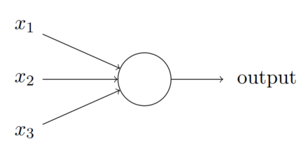
感知器对每个输入都会有一个权重w,就是求输入的加权和，然后和一个阈值进行对比，最后输出0或1。
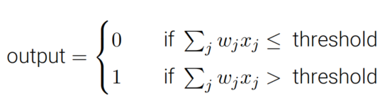

* 与非门
与非门是数字电路中实现逻辑与非的门电路。
与非就是逻辑与和逻辑非的结合，和程序语言中的 !(a&&b) 一样。
就是对于两个二进制输入a,b，当a,b 都为1时输出为0，当a,b不全为1时输出1。其实与非门并不仅限于两个输入，可以有多个输入。
多个与非门可以组成一个逻辑电路，我们经常用的电子产品中的电子芯片即使是由大量的逻辑电路组成。
下面这个逻辑电路实现了加法和乘法。
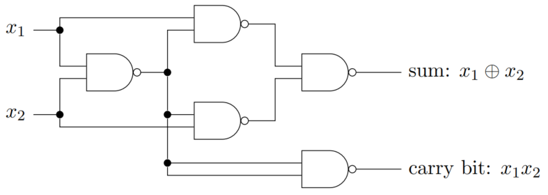
我们知道计算机所有的运算都由加法和乘法组成，所以逻辑电路可以实现所有的数学运算。

* 用感知器实现与非门
我们这里的与非门不是门电路，是一种能够实现同样与非功能的逻辑结构。
下面的这个感知器实现了与非门的功能
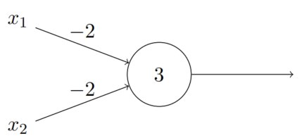
其中$x_1$,$x_2$ 为二进制输入，权重$w_1$,$w_2$均取-2，阈值 $threshold$ 取0，这样感知器便实现了与非门的功能。

* 用感知器模拟函数
感知器可以实现与非门，也就可以实现加法和乘法，进而可以用很多感知器实现数学函数。
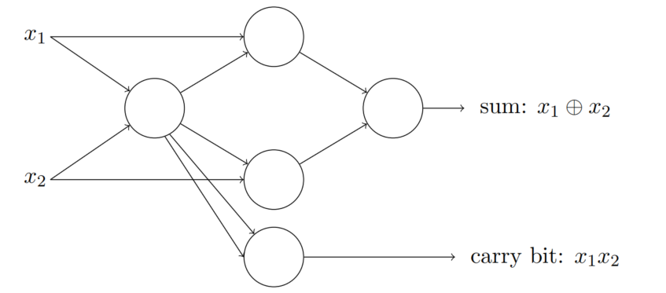

* S型神经元
  不难想象，如果我们由很多感知器相连在一起，仅通过改变感知器的权重就可以实现不同的功能。
  当感知器数量比较多时我们会用学习算法去自动修改感知器的权重。但是由于感知器是一个阶跃函数，在阈值处不可导，或者说导数过大（无穷大），导致我们对权重一个很微小的修改都会造成输出很大的改变，使学习变得极为困难。
  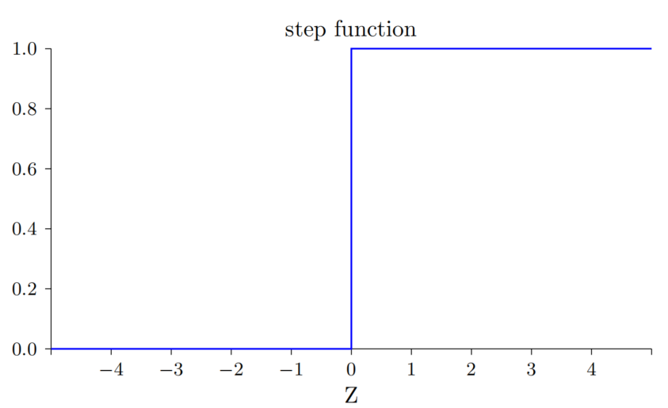
  因此我们对感知器加以改造，使得阈值处变得更为平缓。如下：
  
  这个就是sigmoid函数，数学表达式为：
  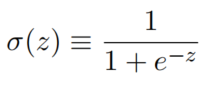
  写上权重的完整表达式为：
  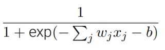
  S型神经元不仅能替换感知器实现数学运算（模拟数学函数）的功能，而且还使权重学习变得可能。

* 手写数字识别
  这是一个识别手写数字的神经网络。输入图像的大小为28*28,输出为10个0到1之间的浮点数，分别对应手写数字0到9，通过argmax操作可以得到对输入图像的预测值。比如，如果第1个值最大，就表明神经网络预测输入图片的数字为0。
  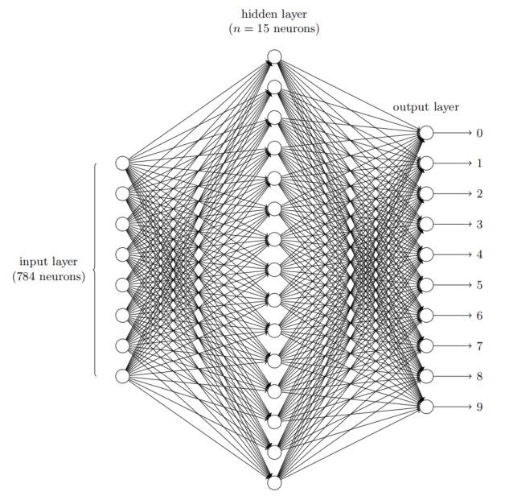

<b>二、神经网络的训练</b>

* 目标函数
&emsp;&emsp;前面我们提到了用学习算法自动修改感知器也就是神经元的权重，我们也把这个过程叫做神经网络的训练。如何训练呢？
&emsp;&emsp;前面我们已经提到可以用来模拟数学函数。假设我们现在用神经网络去模拟函数 $ f=y(x) $, 同时我们定义一个表示神经网络模拟好坏的函数，我们叫它目标函数（或损失函数）,如下：
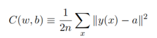
其中$x$为输入，$y(x)$为输出，$a$为我们想要的输出，$w$，$b$为神经网络所有神经元的权重和偏置，n为输入值的数量。
&emsp;&emsp;当$y(x)$和$a$的值比较接近时，目标函数$C$就比较小。反过来，当$C$比较大时说明$y(x)$和$a$的差距比较大。所以我们希望能够调整神经网络的参数$w$和$b$使得$C$值尽可能小。那么这个问题在数学上就变成了求函数$C(w,b)$的的最小值点。

* 梯度下降
  &emsp;&emsp;我们知道对于一个一元连续可导的凸函数来说，最小值点的导数为0。我们对函数求导，令导数为0即可找到最小值点。但神经网络是一个非凸函数，并且维度很高，直接求解析解是不现实的。
  &emsp;&emsp;设想一下下山的情形，假设我们现在在山坡上，雾很大，我们想要下到山谷的最低处。由于山势多变，视野也较差，所以我们没有方向可以直接到达目的地。为了尽快到达目的地，我们沿着山最陡峭的地方向下走（假设我们不怕摔\^_^）。假如我们运气好，最终在饶了几圈之后就能达到最低点。假如运气不太好，虽然我们到达的地方不是最低点，也会是一个比较低的点。这就是梯度下降法。
  &emsp;&emsp;我们沿着梯度的方向调整神经网络的参数$w$和$b$，直到目标函数$C$下降到一个我们可以接受的范围。
  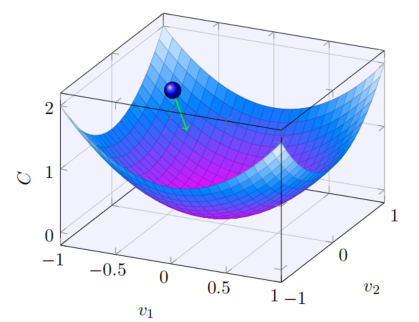
* 反向传播
  &emsp;&emsp;我们已经有了梯度下降的思路，接下来就是求梯度, $\frac{\partial C}{\partial w}$和$\frac{\partial C}{\partial b}$。我们要求出来每一个权重的偏导$\frac{\partial C}{\partial w_{jk}^l}$和每一个偏置的偏导$\frac{\partial C}{\partial b_j^l}$，其中$w_{jk}^l$表示第$l-1$层的第$k$个神经元到第$l$层的第$j$个神经元的连接权重，$b_j^l$表示第$l$层的第$j$个神经元的偏置。
  &emsp;&emsp;由于前面的层的输出是后面层的输入，所以神经网络可以看作一个复合函数。根据链式法则，求偏导的时候要先求后面层神经元的偏导，然后再求前面层的偏导。同时为了减少计算量，我们使用计算前面神经元偏导时也会用到前面已经计算过的结果。定义目标函数$C$对第$l$层第$j$个神经元的输入$z_j^l$的偏导为$\delta _j^l = \frac{\partial C}{\partial z_j^l}$。所谓反向传播就是我们将后面层神经元的输入偏导$\delta^l$逐层传播到前面,即根据$\delta^l$求出$\delta^{l-1}$，然后根据$\delta^{l-1}$求出权重$w^{l-1}$和偏置$b^{l-1}$的偏导,以此类推。
  * 四个基本方程
  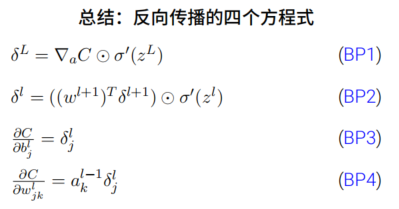
  * 证明
  BP1
    $$\delta ^l = \frac{\partial C}{\partial z^l}=\frac{\partial C}{\partial a^l}\cdot \frac{\partial a^l}{\partial z^l}=\nabla a\cdot \sigma '(z^l)$$
  BP2(这里把b视为$w_0$)
  $$\delta ^l = \frac{\partial C}{\partial z^{l+1}}\cdot \frac{\partial z^{l+1}}{\partial z^l}$$
  $$=\frac{\partial C}{\partial z^{l+1}}\cdot \frac{\partial ((a^{l})^T\cdot {w^{l+1}}+b^{l+1})}{\partial z^l}$$
  $$=\frac{\partial C}{\partial z^{l+1}}\cdot \frac{\partial ((\sigma (z^l))^T\cdot {w^{l+1}} +b^{l+1})}{\partial z^l}$$
  $$=\frac{\partial C}{\partial z^{l+1}}\cdot \frac{\partial ((\sigma (z^l) )^T \cdot {w^{l+1}})}{\partial z^l}+\frac{\partial C}{\partial z^{l+1}}\cdot \frac{\partial b^{l+1}}{\partial z^l}$$
  $$=((w^{l+1})^T\delta ^{l+1})\cdot \sigma '(z^l)$$
  BP3
  $$\frac{\partial C}{\partial b_j^l}=\frac{\partial C}{\partial z_j^l}\cdot \frac{\partial z_j^l}{\partial bj^l}=\delta j^l$$
  BP4
  $$\frac{\partial C}{\partial w_{jk}^l}=\frac{\partial C}{\partial z_j^l}\cdot \frac{\partial z_j^l}{\partial w_{jk}^l}=\frac{\partial C}{\partial z_j^l}\cdot \frac{\partial (((a_k^{k-1}))^T\cdot{w_{jk}^l}) }{\partial w_{jk}^l}=a_k^{k-1}\delta _j^l$$  
  
  就这样我们从后向前依次算出每个神经元权重$w$,$b$的梯度$\nabla w$和$\nabla b$，然后更新它们,简写如下：
  $$ w_{new} = w - \lambda \nabla w $$
  $$ w_{new} = w - \lambda \nabla w $$
  这里$\lambda$表示参数更新的速度，我们叫学习率。
  

<b>三、神经网络的缺陷</b>

* 梯度消失与梯度爆炸
  &emsp;&emsp;实践表明，更深的神经网络通常具有更强的模拟函数的能力。比起能力的增强，训练的难度增加的更多。表现就是，当我们用了更深的网络后，网络的表现变差了，这是因为我们没有训练好。这时我们观察网络的权重$w$会发现，后面的层的权重在变化，前面的网络层的权重变化的很慢甚至不再变化，也就是说它们停止学习了。
  &emsp;&emsp;让我们回顾一下网络是如何学习的。
  $$ w_{new} = w - \lambda \nabla w $$
  $$ w_{new} = w - \lambda \nabla w $$
  我们在训练网络时会保证学习率不为0，说明网络不学习是因为梯度$\nabla w$和$\nabla w$变成了0或者接近0，我们称这个现象为消失的梯度问题。
  我们现在要找出梯度消失的原因。为了便于分析，我们考虑一种简单的情况，网络的每一层只有一个神经元。
  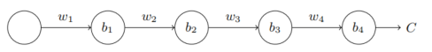
  这里$w_i$表示权重，$b_i$表示偏置，$a_i$表示神经元的输出。$z_i$表示神经元的加权输入，就是$z_i=w_i x + b_i$。$\sigma$表示激活函数，这里认为是$sigmoid$。
  因为网络结构比较简单，我们直接用链式法则求梯度：
  $$\frac{\partial C}{\partial z_1}=\frac{\partial C}{\partial z_4}\frac{\partial z_4}{\partial z_3}\frac{\partial z_3}{\partial z_2}\frac{\partial z_2}{\partial z_1}$$
  $$=\frac{\partial C}{\partial a_4}\frac{\partial a_4}{\partial z_4}\frac{\partial z_4}{\partial z_3}\frac{\partial z_3}{\partial z_2}\frac{\partial z_2}{\partial z_1}$$

  $$=\frac{\partial C}{\partial a_4}\frac{\partial a_4}{\partial z_4}\frac{\partial (w_4a_3+b_4)}{\partial z_3}\frac{\partial (w_3a_2+b_3)}{\partial z_2}\frac{\partial (w_2a_1+b_1)}{\partial z_1}$$

  $$=\frac{\partial C}{\partial a_4}\sigma '(z_4)w_4 \sigma '(z_3)w_3 \sigma '(z_2)w_2 \sigma '(z_1)$$
  下面求$w_1$,$b_1$梯度：
  $$\nabla w_1=\frac{\partial C}{\partial w_1}=\frac{\partial C}{\partial z_1}\frac{\partial z_1}{\partial w_1}=\frac{\partial C}{\partial z_1}x$$
  $$=\frac{\partial C}{\partial a_4}\sigma '(z_4)w_4 \sigma '(z_3)w_3 \sigma '(z_2)w_2 \sigma '(z_1)x$$
  $$\nabla b_1=\frac{\partial C}{\partial z_1}$$
  $$=\frac{\partial C}{\partial a_4}\sigma '(z_4)w_4 \sigma '(z_3)w_3 \sigma '(z_2)w_2 \sigma '(z_1)$$
  &emsp;&emsp;我们发现，梯度$\nabla w$和$\nabla b$主要是形如$\sigma'(z_i)w_{i-1}$的连乘。其中$\sigma'(x)<=\sigma'(0)=\frac{1}{4}$。权重的一种初始化方式就是初始化为均值为0，方差为1的高斯分布。此时所有的$w$都满足$|w_i|<1$。这时候梯度$\nabla w$和$\nabla b$经过多个$\sigma'(z_i)w_{i-1}$的连乘后会变得非常小，直至为0。这就是梯度消失的产生的原因。
  &emsp;&emsp;现在为了避免梯度消失，我们修改权重初始化策略，我们把权重初始化的大一些。假设初始化的够大，这时$\sigma'(z_i)w_{i-1}$比1大很多。这时多个比1大很的乘子相乘，结果又会非常大，造成梯度非常大，权重变化很剧烈，又出现了前面所述的“一个很微小的修改都会造成输出很大的改变，使学习变得极为困难”。这就是梯度爆炸问题。
  &emsp;&emsp;问题的根本不在于权重的初始化大小，而是因为前面的梯度是后面层的梯度和权重的乘积，当层数较深的时候就会造成梯度不稳定，这叫做不稳定的梯度问题。如果没有某种机制或者更加本质的保证来达成平衡，网络就很容易不稳定。只要我们使用上述的梯度学习算法，在网络的包不同层就会出现学习速度不同的情况。
  &emsp;&emsp;后面在其他章节计算机视觉和自然语言处理的部分我们会看到不同的解决“不稳定的梯度问题”的方法。

<b>四、深度神经网络</b>

&emsp;&emsp;前面我们讲述了一般的神经网络，网络结构、学习原理以及在并不算深的神经网络中出现的梯度消失和梯度爆炸问题。本章我们会简单的引入深度神经网络以便过渡到后面的章节。
&emsp;&emsp;虽然深度神经网络会遇到“不稳定的梯度问题”导致难以训练，但是前人依然通过各种方法解决了这个问题并做出了许多开创性的工作，展示了深度神经网络强大的性能。前面展示的神经网络叫做全连接神经网络，是因为网络的每一层的每个神经元都和其他层的每个神经元相连。也叫做前馈神经网络，是因为网络的输入只从前往后传输。接下来我们将要介绍的是与此不同的神经网路，卷积神经网络和循环神经网络。

* 卷积神经网络（CNN）
  卷积网络是一种专门用来处理具有局部相关性的书的神经网络，比如图像数据。卷积网络在诸多应用领域都表现优异。卷积网络市镇那些至少在网络的一层使用卷积运算替代一般的矩阵乘法运算（全连接层）的神经网络。
  * 卷积运算
  我们先通过一个场景介绍一下数学上的卷积运算。
  小明每天摄入三聚氰胺的量用f(t)表示，三聚氰胺随着时间在体内的残余量用函数g(t)表示。那么第k天小明体内三聚氰胺的残余量就是
  $$\int f(t)g(k-t)dt$$
  离散形式就是：
  $$\sum_{t}f(t)g(k-t)$$

  卷积网络中的卷积是二维卷积，形式上稍有差异，本质是相同的。以图像卷积为例（以下三张关于卷积的图片来自[如何通俗地理解卷积？](https://www.matongxue.com/madocs/32.html)）
  
  
  $c_{1,1}$计算公式如下：
  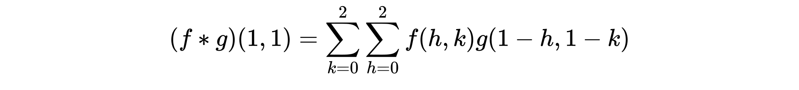

  通过这样的卷积操作，可以提取出图像的局部特征。比如边缘检测：
  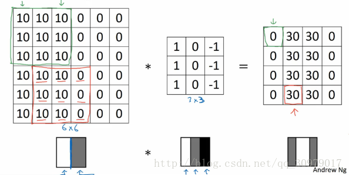
  
  这里的卷积核参数是固定的，卷积网络的卷积核参数是可以学习的，所以通过学习应用于不同的任务比如图像分类，目标检测等。
  
  卷积网络就是若干个这样的卷积运算叠加在一起。
  卷积神经网络通常会在每个卷积操作后面加上一个激活函数，$sigmoid$或者$relu$，形如$sigmoid(f*g+b)$。

* 循环神经网络（RNN）
  循环神经网络是一类用于处理序列数据的神经网络。就像卷积网络是专门用于处理网格化数据的神经网络，循环神经网络是专门用于处理序列数据的神经网络。正如卷积网络可以很容易地扩展到具有很大宽度和高度的图像，以及处理大小可变的图像，循环网络可以扩展到更长的序列。大多数循环网络也能处理可变长的序列。  

  循环网络和卷积网络一样都有参数共享。参数共享使得模型能够扩展到不同形式的样本（这里指不同长度的样本）并进行泛化。如果在每一个时间点都有一组单独的参数，模型不但不能泛化到训练时没有见过的序列长度，也不能在时间上共享不同序列长度和不同位置长度的统计强度。当信息的特定部分会在序列内多个位置出现时，这样的共享尤为重要。