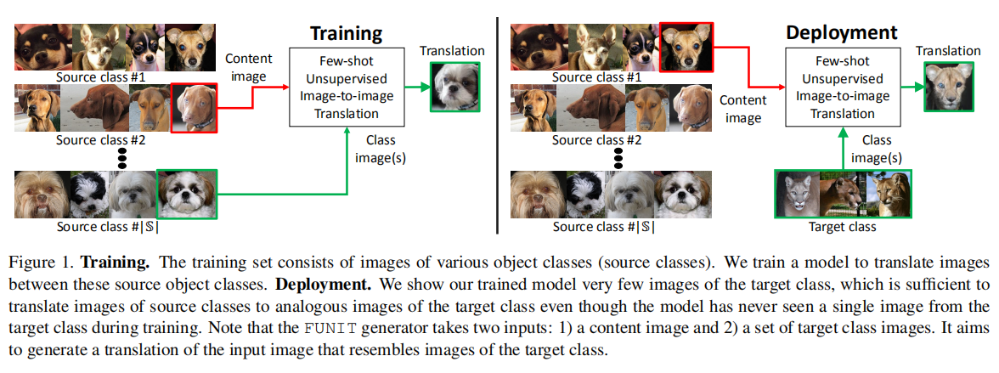
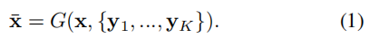
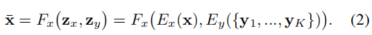
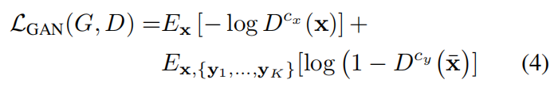
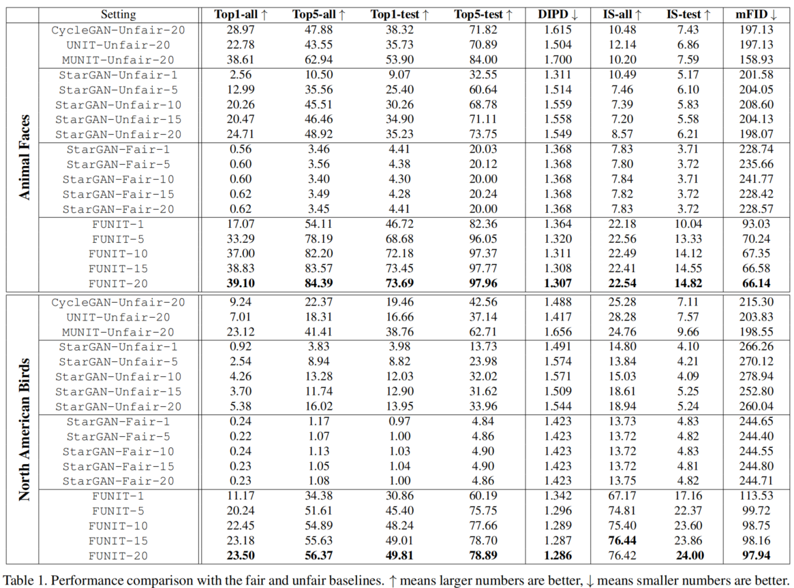
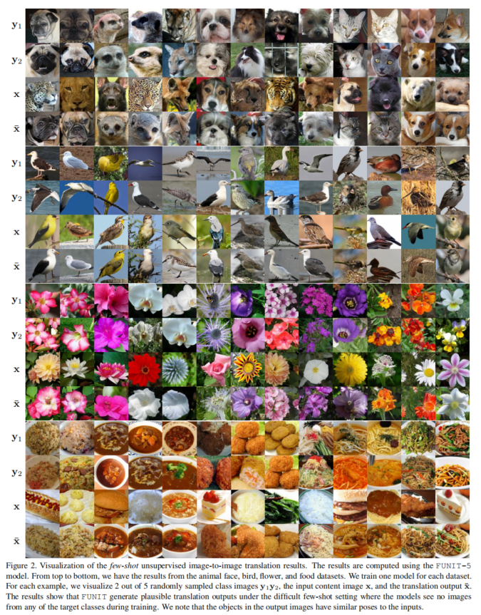
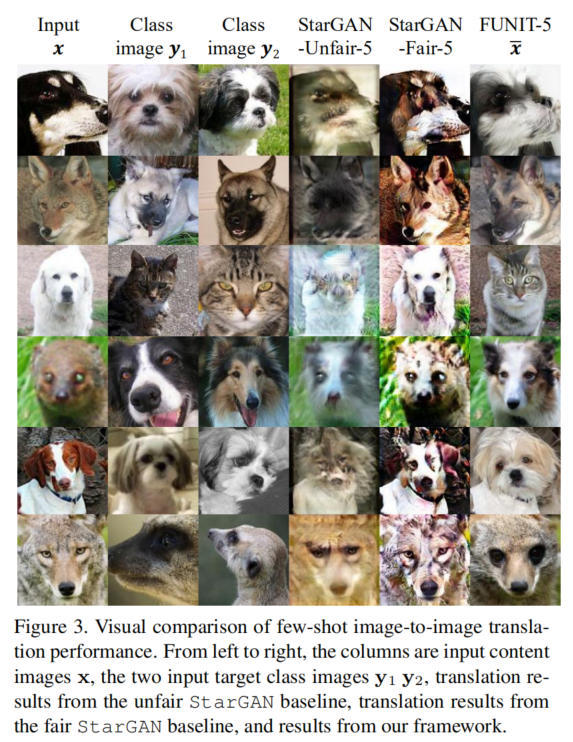
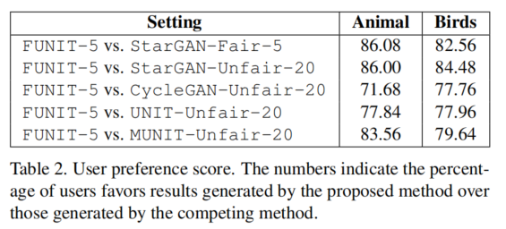
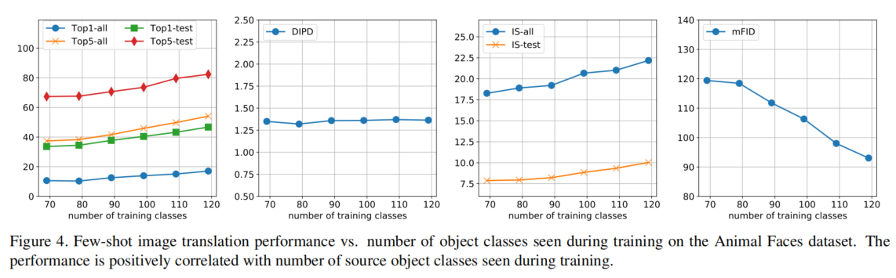

<b>Few-Shot Unsupervised Image-to-Image Translation</b>

这是NVIDIA出的小样本无监督图像转换。论文[Few-Shot Unsupervised Image-to-Image Translation](resource/FUNIT/Few-Shot-Unsupervised-Image-to-Image-Translation.pdf)。

#### 摘要

无监督图像转换方法学习在不受限的图像数据集上绘画，将一张图像映射成相似的不同种类的图像。虽然有了显著的成果，但是现在的方法在训练时需要大量的源图像和目标图像。我们认为这严重影响了这些方法的应用。从人类可以从极少数样本中提取本质并泛化的能力得到启发，我们寻求一种小样本，无监督图像到图像转换算法。**这种算法适用于测试时仅由少量样本图像指定的以前没见过的目标类。我们的模型通过将对抗训练与新颖的网络设计相结合，实现了小样本泛化能力。** 通过广泛的实验验证和与基准数据集的几种baseline方法的比较，我们验证了所提出框架的有效性。
代码：https://github.com/NVlabs/FUNIT

>下文只是随读随记，全部读完之后会做一个总结整理。

##### 3. Few-shot Unsupervised Image Translation

训练数据：
source classes: a set of object classes (e.g. images of various animal
species)
不假定任何两个类别之间存在成对的图像（比如，没有两个不同类别的动物有完全相同的姿势）
个人理解：作者只是没有做这个假定，不能确定是否有，或者说，即使有，也不去使用这个特性。
用源数据训练一个多类无监督图像转换模型。测试时，从一个新颖的物体类给模型提供少量的图片，这叫做target class。

模型不得不利用少量的目标图片将任意的源类别图像转换为目标类别的相似图像。
当我们更换不同的新物体类别给这个模型的时候，它也需要将任意的源类别图像转换成新的目标类别的相似图像。

这个框架包括一个**条件图像生成器G**和一个**多任务对抗判别器D**。和已有的无监督图像转换框架[54,29]中的传统图像生成器不同,我们的生成器G同时以内容图像(content image) x 和 一个K个图像集合${\{y_1,...,y_k\}}$作为输入，产生输出图像$\bar{x}$:

我们假定 content image属于类别 $c_x$, K个图像中的每一个图像都属于类别$c_y$。
通常K很小并且$c_x$和$c_y$不同。我们会让G作为小样本图像转换器。
如图1所示，G将一个输入content image $x$映射为一个输出图片$\bar{x}$。$\bar{x}$外观上属于类别$c_y$，结构上(姿态上)却和$x$相近。
用$\mathbb{S}$和$\mathbb{T}$表示源类集合和目标类集合。在训练时，G学习转换从源类中随机抽样出来的两个类别$c_x,c_y\in \mathbb{S}$并且$ c_x\neq c_y$。在测试时，G从从未见过的目标类别$c\in \mathbb{T}$中取少量图像，将任意一个源类别图像映射为目标类别的相似图像。

#### 网络的设计和训练

##### 3.1. Few-shot Image Translator

小样本图像转换器G包含了一个内容编码器$E_x$，一个类别编码器$E_y$和一个解码器$F_x$。

内容编码器由几个残差块和2D卷积层组成。它将输入content image x 映射为 content 潜在编码 $z_x$(空间特征图)。

类别编码器由几个2D卷积层和一个样本轴上的均值操作组成。它首先将K个不同类别的图像${y_1,...,y_k}$映射为一个中间潜在向量，然后计算潜在向量的均值得到最后的类别潜在编码$z_y$。

解码器包含几个自适应实例标准化(instance normalization)（AdaIN[18]）残差块[19]和一对上采样(upscale)卷积层。AdaIN残差块就是使用AdaIN作为normalization layer的残差块。对每一个样例，AdaIN首先将样例在每个通道的激活值标准化为零均值和单位方差，然后使用学习到的仿射变换缩放激活值。这个仿射变换由scalars和biases集合组成。注意这个仿射变换具有空间不变性因此只能用于获取全局表观信息(global appearance information)。仿射变换参数使用$z_y$通过一个两层全连接网络自适应计算得到。代入$E_x,E_y,F_x$,(1)式可以分解为:

通过这种设计，我们旨在使用内容编码器提取类别无关（class-invariant）潜在表示（比如物体姿态），使用类别编码器提取类别相关(class-specific)潜在表示（比如物体外观）。通过将类别潜在编码输入到解码器的AdaIN层，我们使类别图像控制全局外观（比如物体外观），同时内容图像决定局部结构（比如眼睛的位置）。

在训练阶段，类别编码器学习从源类别图像提取类别潜在表示。在测试阶段，泛化为从之前未见过的类别的图像提取。在实验部分，我们证明这个泛化能力依赖于在训练阶段见到的图像类别的数量。训练G时用的源类别越多(比如更多的动物种类），小样本图像转换的性能就越好（比如，从哈士奇转化为美洲狮的效果更好）。

##### 3.2. Multi-task Adversarial Discriminat

我们的判别器D由多个判别分类任务同时训练。每个任务都是二分类，预测一张输入图像是源类别的真实图像还是由G转换得到的图像。因为有$\left | \mathbb{S} \right |$个源类别，D产生$\left | \mathbb{S} \right |$个输出。
更新D时，给D输入类别为$c_x$的真实图片，当D的第$c_x$个输出为false时惩罚D。给D输入类别为$c_x$的假图片，当D的第$c_x$个输出为真时惩罚D。当其他类别($\left | \mathbb{S} \right |\setminus {c_x}$)的图像没有预测为falses时不惩罚D。
更新G时，仅当D的第$c_x$个输出为false时惩罚G。
经验发现，这个判别器效果比$\left | \mathbb{S} \right |$分类训练的判别器效果好。

##### 3.3. Learning

我们通过解决一个minimax优化问题训练FUNIT框架：
其中，$L_GAN,L_R,L_F$分别是GAN loss，内容图像重构 loss，和特征匹配 loss。

GAN loss:

D的上标表示物体类别；loss只用相应的二分类预测得分计算。

内容重构loss帮助G学习转换模型。特别地，当使用相同的图像作为输入内容图像和输入类别图像时（这时K=1）,loss会促使G生成和输入相同的图像

特征匹配loss正则化训练。首先通过移除D的最后一层，构造一个特征提取器，用$D_f$表示。然后使用$D_f$从转换输出$\bar{x}$和类别图像${\{y_1,...,y_k\}}$提取特征并且最小化：

内容转换loss和特征匹配loss都不是图像转换的新话题[29,19,49,36]。我们的贡献在于扩展了它们在更具挑战和更新颖的小样本无监督图像转换领域的使用。

##### 4. Experiments

* 实验
  设置$ \lambda_R=0.1, \lambda_F=1 $。
  使用RMSProp，学习率0.0001优化(3)式。
  使用GAN loss[28,32,52,6]的hinge版本
  和Mescheder等人提出的[31]real gradient penalty regularization
  最后的生成器是中间生成器[23]的历史平均版本，更新权重是0.001
  训练FUNIT模型时K=1,测试时K=1,5,10,15,20.
  每个batch 64个内容图片，平均地分布在一个NVIDIA DGX1机器的8个V100 GPU上。

* 数据集
  * Animal Faces. 
  这个数据集由ImageNet[9]中的149种肉食性动物的图片构建。首先从其中手动标注10000个肉食性动物的面部bounding box。然后训练一个Faster RCNN检测图片中动物的面部。我们只使用检测得高分的bounding box。这样得到了一个大小为117574的动物面部图片集。其中119个类别作为source class set, 30个类别作为 target class set.
  * Birds[47].
  555种北美鸟类图片，共48527张。444个类别作为source class set，111个类别作为target class set。
  * Flowers[35].
  102种公8189张图片。source 和 target种类数目分别为85和17.
  *Foods[24].
  256类食物共31395张图片。source和target分别有224和32个类别。

* 疑问
前两个数据集source和target的类别数目比例都为4:1，后两个数据集source和target的类别数目比例分别为5:1和7:1。为什么这样分配？
如果说第三个的比例是因为图片数量少，第四个为什么是7:1？是因为食物图片虽然多，但相对于食物的多样化并不算太多？

* Baselines.
  基于在训练期间target class的图片是否可用（是否有），定义两个baseline集合：fair(没有)和 unfair(有)
  * Fair.
  这就是提出FUNIT框架的背景。因为之前没有用于这个背景的无监督图像转换方法，我们通过扩展StarGAN[8]构建了一个baseline，这个baseline是多类无监督图像转换的state of the art。
  训练时，我们仅使用source class 图片训练StarGAN。
  测试时，给定 K image of target class，我们计算这K个图片VGG[41] Conv5特征的平均值并且计算source class的每一个图片和VGG Conv5 特征的余弦距离。然后对余弦距离计算softmax得到类别相关向量。用类别相关向量作为StarGAN的输入（取代one-hot类别相关向量输入）生成未见过的target class图片。
  这个baseline的设计基于这样一个假设，假设类别相关得分可以编码一个未见过的target object class和每一个source class图片有多么相似，这可以用于小样本生成。我们命名这个baseline为`StarGAN-Fair-K`。
  
  * Unfair
  这类baseline的训练过程有target class 图像。我们从1到20改变target class可用图片的数量，训练各种不同的无监督图像转换模型。我们把每个target class用K个图片训练的StarGAN模型叫做 `StarGAN-Unfair-K`。我们还训练了几个state-of-the-art的 two-domain转换模型，包括CycleGAN[54],UNIT[29],和MUNIT[19]。对于这些模型，我们把source classes图片作为first domain，把target classes中的其中一个类别的图片作为second domain.这样产生$|\mathbb{T}|$个无监督图像转换模型，每个数据集（target class）一个two-class baseline。我们把这些baselines标记为CycleGAN-Unfair-K,UNIT-Unfair-K和MUNIT-Unfair-K。
  对于这些baseline模型，我们使用作者提供的源码和默认超参数。

* Evaluation protocol.
  我们使用从source classes中随机抽样的25000张图片作为content images。。然后从每个target class中随机抽样K张图片并转换到每个target class。每一种转换方法都产生了$|\mathbb{T}|$个图片集合用于评估。所有的转换方法，对于每一个content image，我们使用同样的 K张图片。我们测试了一个范围内的K值，包括1,5,10,15,20。

* Performance metrics.
  我们使用几个标准用于评估。首先，我们恒量转换图片和目标类图片是否相似。然后，我们考量在转换过程中类别不变内容是否被保留。最后，我们恒量模型能否用来生成一个target class的图像分布。我们将在下面简要介绍这些标准的性能指标，并在附录中留下详细信息。

  * Translation accuracy 恒量一个转换输出是否属于target class。我们使用两个 InceptionV3[44]分类器。一个分类器使用source 和 target classes训练（记为all）。另一个只用target classes训练(记为test)。我们给出 Top1和Top5准确率。
  * Content perservation 基于一个感知距离[22,53]的变种，叫做domain-invariant perceptual distance(DIPD)[19]。The distance is given by L2 distance between two normalized VGG [41] Conv5 features,which is more invariant against domain change [19].
  * Photorealism.(真实感) 由inception scores(IS)[39]度量。We report inception scores using the two inception classifiers trained for measuring translation accuracy,denoted by all and test, respectively.
  * Distribution matching is based on Frechet Inception Distance (FID) [17]. We compute FID for each of the $|\mathbb{T}|$ target object classes and report their mean FID (mFID).

* Main results.
  如Table 1 所示, 我们提出的FUNIT框架在 Animal Faces和 North American Birds数据集上的所有性能度量的表现都要优于这些小样本无监督图像转换的baselines.对于1-shot和5-shot设置，FUNIT在Animal Face 数据集上分别达到了82.36和96.05的Top-5准确率，在North American Birds 数据集分别达到了60.19和75.75的Top-5准确率。它们都显著的比对应的fair baselines好很多。相似的情况也出现在domain invariant perceptual distance, inception score, 和 Frechet inception distance。甚至，只用 5 shots, FUNIT的表现优于所有20-shot的unfair basellines. 注意 CycleGAN-Unfair-20, UNIT-Unfair-20,和 MUNIT-Unfair-20的结果都是 $|\mathbb{T}|$ 图像转换网络，同时我们的方法是单图像转换网络。

  这个表也表明 FUNIT 模型的性能和测试时target images的数量 K 成正相关。更大的 K 能够促进所有的指标提升，从 K=1到K=5 提升的最快。StarGAN-Fair baseline 没有类似的规律。

  
  在 Figure 2 中, 我们可视化了 FUNIT-5 得出的雄安拥抱转换结果。结果显示 FUNIT 能够成功地将source classes地图片转换成与新target class 图片相似的图片。input content image $X$ 的姿态和输出图片 $\bar{X}$ 非常一致。同时输出图片和target classes图片相比很相似、逼真。

  
  在 Figure 3 中， 我们提供一个可视化对比。因为baselines 并不是被设计用来做小样本图像转换，所以它们在转换任务上表现不好。它们要么生成大量的人造图片要么只是输出了input content iamge。另一方面，FUNIT 生成了高质量的转换图片。

* User Study.
  为了比较转换输出的真实感和faithfulness，我们使用 Amazon Mechanical Turk(AMT)平台做了人工评估。特别地，我们对不同的方法给出一个target class image和两个转换输出，然后让workers（人）去选择和targe class image更像的输出图像，不限制选择的时间。Animal Faces 和 North American Birds 数据集都使用。每次对比，我们随机生成500个问题，并且每个问题都由5个不同的workers回答。为了控制质量，每一个worker必须具有大于98%的终身任务通过率才能参与评估。

  
  根据 Table 2, 人们主观地认为由提出的方法在5-shot的设置下（FUNIT-5）产生的转换输出 与 同样设置的 fair baseline （StarGAN-Fair-5）产生的输出相比，前者与target class 图像更相似。即使与 训练时每个target class 20张图片的 unfair baselines相比，人们仍然认为我们的结果更可信。

* Number of source classes in the training set.
  在 Figure 4 中，我们分析了使用动物数据集，在one-shot设置下(FUNIT-1)性能与训练集source classes数量的关系。我们间隔为10画出了source classes类别数从69到119的曲线。如图所示，转换准确率，图像质量，和分布与物体类别的数量成正相关。域不变感知距离(domain-invariant perceptual distance)保持平坦。这表明，FUNIT在训练阶段见越多的物体类别，在测试阶段表现就更好。相似的规律在bird数据集可以观察到，附录中有展示。

* Parameter analysis and ablation study. 
  我们分析目标函数中每一项的作用发现它们都有效。特别地，内容重构 loss 能提高内容保留分数。附录中有实验结果。

* Latent interpolation.
  在附录中，我们展示了保持内容编码固定，在两个source class的类别编码之间插值的结果。有趣的是，通过在两个source class（Siamese cat and Tiger）之间插值，我们有时能够生成一个从未见过的target class(Tabby cat)。

* Failure cases.
  附录中有我们提出的算法的几个失败案例。它们包括生成混合物体，忽略 input content images,和忽略input class images.

* Few-shot transloation for few-shot classification.
  我们使用动物和鸟类数据集评估FUNIT的小样本分类性能。特别地，我们使用训练的FUNIT模型去给每一个小样本类别生成 N（从1，50到100）个图片然后使用生成的图片去训练分类器。我们发现使用FUNIT生成的图片训练的分类器比Hariharan et al. [15]提出的基于特征幻觉（feature hallucination）小样本分类方法能达到更好的效果。结果展示在Table 3 中，实验细节在附录中。

##### 5.Discussion and Future Work

我们引入首个小样本无监督图像转换框架。我们证明小样本生成性能和训练阶段见到的物体类别数量成正相关，同时也和测试阶段提供的目标类别样本数量成正相关。
经验表明FUNIT通过在测试阶段使用一些未见过的类别样本可以学习转换一个source class图片到一个未见过的类别的图片。 