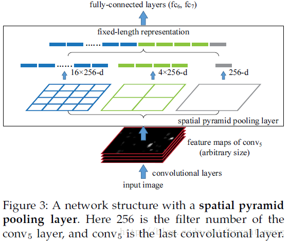
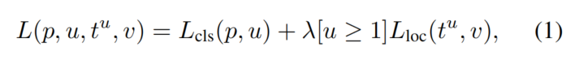
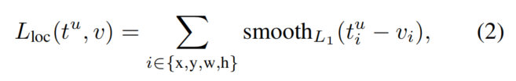
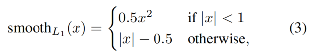
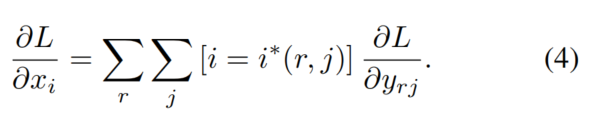
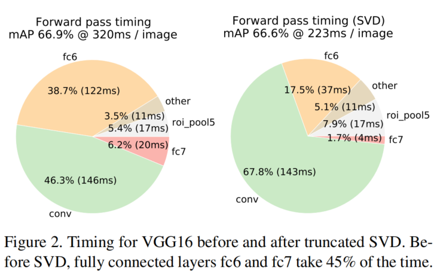
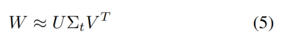
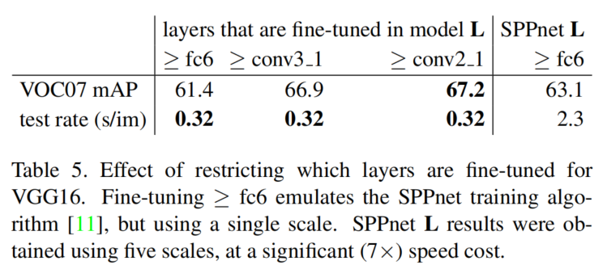
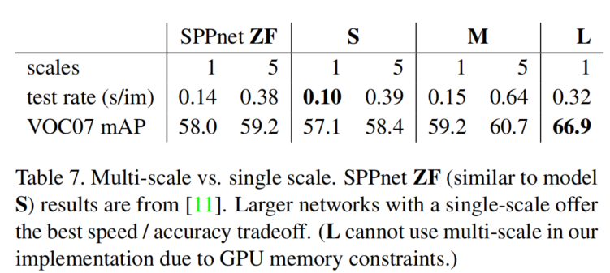
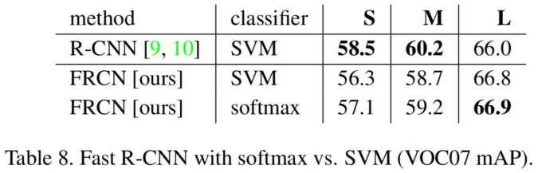

<center><b>Fast R-CNN</b></center>

论文:[Fast R-CNN](resource/FastRCNN/FastRCNN.pdf)  
Caffe代码:https://github.com/rbgirshick/fast-rcnn  

* [1. Introduction](#introduction)
* [2. Fast R-CNN architecture and training](#architecture)
  * [2.1. The RoI pooling layer](#roi-pooling)
  * [2.2. Initializing from pre-trained networks](#pre-train)
  * [2.3. Fine-tuning for detection](#fine-tuning)
    * [Multi-task loss](#multi-task-loss)
    * [Mini-batch sampling](#mini-batch-sampling)
    * [Back-propagation through RoI pooling layers.](#back-propagation-roi)
    * [SGD hyper-parameters.](#sgd-parameters)
    * [Scale invariance](#scale-invariance)
* [3. Fast R-CNN detection](#detection)
  * [3.1. Truncated SVD for faster detection](#svd)
* [4.Main results](#results)
  * [4.5. Which layers to fine-tune?](#fine-tune)
* [5. Design evaluation](#design-evaluation)
  * [5.1.Does multi-task training help?](#does-multi-task-help)
  * [5.2. Scale invariance: to brute force or finesse?](#which-scale-invariance)
  * [5.3. Do we need more training data?](#more-data)
  * [5.4. Do SVMs outperform softmax?](#svm-softmax)
  * [5.5. Are more proposals always better?](#more-proposals)


========================================================================  

<span id="introduction">
<b>1. Introduction</b>
</span>

Fast RCNN 属于目标检测领域，是对RCNN和SPPNet的改进。
[RCNN](RCNN.md)主要有如下问题:

（1）训练分多阶段。预训练->调优训练->SVM分类->bbox回归  
（2）训练需要大量的时间和空间。从候选区域提取的特征需要使用很长时间，并且特征需要保存到磁盘上，需要占据大量磁盘空间。  
（3）检测速度慢。在测试阶段每个候选区域都要被检测一遍。  


RCNN之所以慢主要是因为它对每一个候选区域做卷积运算，没有共享计算。空间金字塔池化网络（[SPPnets](SPPNet.md)）[11]通过共享计算来加速RCNN。SPPnet计算整个输入图像的卷积特征图，然后使用从共享特征图中提取的特征向量对每个物体进行分类。SPPnet通过将输入图像池化为三个固定尺寸的特征图来处理不同大小的图像输入。如下图所示：



SPPnet的测试时间比RCNN提升了10到100倍，训练时间比RCNN提升了3倍。但SPPnet和RCNN一样是多阶段的，需要预训练、调优训练、训练SVM分类器、bbox回归，特征也要保存到磁盘。SPPnet有一个独有的缺点就是模型调优时不能更新金字塔池化层前面的卷积层，这限制了比较深的网络的准确率。
Fast RCNN改进了RCNN和SPPnet的以上缺点，同时提升了速度和准确率。主要优点有：  
（1）检测质量（mAP）比RCNN、SPPnet更高  
（2）训练是单阶段的，使用多任务loss  
（3）训练时可以更新所有的网络层  
（4）特征不需要存储到磁盘  

<span id="architecture">
<b>2. Fast R-CNN architecture and training</b>
</span>


Figure 1展示了Fast RCNN的结构。Fast RCNN以整张图像和一组候选区域作为输入。网络首先使用几个卷积层和最大池化层对输入图像提取特征图。然后对每个候选区域，由ROI(region of interest) 池化层从特征图中提取出固定大小的特征向量。每个特征向量都被送入一系列全卷积层，最后分成两个输出：一个是K类物体加上一个背景的softmax分类概率，另一个是每个物体的bbox位置（四个值）。

<span id="roi-pooling">
<b>2.1. The RoI pooling layer</b>
</span>

RoI池化层使用最大池化将感兴趣的有效区域内的特征转化为固定大小HxW（比如，7x7）的小特征图,其中 H 和 W 是层超参数，和 RoI无关。在本篇论文中，RoI是一个卷积特征图上的矩形窗口。每个RoI通过一个四元tuple (r,c,h,w) 定义，指定左上角(r,c)和 宽高(h,w)。

RoI最大池化将 h x w 的 RoI 窗口分成 H x W 的网格，每个网络尺寸大约为 h/H x w/W , 然后取每个网格的最大值。每个特征通道的池化就像最大池化那样是独立进行的。RoI池化是SPPnet中空间金字塔池化的特例，这里只有一层金字塔。

>作者的RoI 池化层的实现代码:https://github.com/rbgirshick/caffe-fast-rcnn/blob/bcd9b4eadc7d8fbc433aeefd564e82ec63aaf69c/src/caffe/layers/roi_pooling_layer.cpp
https://github.com/rbgirshick/caffe-fast-rcnn/blob/bcd9b4eadc7d8fbc433aeefd564e82ec63aaf69c/src/caffe/layers/roi_pooling_layer.cu

<span id="pre-train">
<b>2.2. Initializing from pre-trained networks</b>
</span>

我们实验了三个ImageNet[4]预训练模型，每个都有 5 个最大池化层和 5 到 13 个卷积层（详见4.1章）。使用预训练网络初始化Fast RCNN，有三个修改。
第一、最后一个最大池化层被一个RoI池化层代替，通过设置H和W以和后面的第一个全连接层兼容（比如，对于VGG16，H=W=7）。
第二、网络的最后一个全连接层和softmax层（ImageNet1000分类）被替换为两个并列全连接层（一个全连接层用于K+1分类，另一个做指定类别的bbox回归）。
第三、网络修改为两个输入：一组图像和一组图像对应的候选区域。

<span id="fine-tuning">
<b>2.3. Fine-tuning for detection</b>
</span>

使用反向传播训练所有网络权重是Fast RCNN的 重要能力。首先，我们阐述**为什么SPPnet不能更新空间金字塔池化下的权重。**

**根本原因是当每个训练样例（比如 RoI）都来自不同的图像时，通过SPP层的反向传播非常低效**，这正是RCNN和SPPnet的训练方式。效率低下的原因在于每个RoI可能有非常大的感受域，通常跨越整个输入图像。由于前向传播必须处理整个感受域，所以训练输入会很大（通常是整个图像）。

我们提出了一个更有效的训练方法，利用训练期间的特征共享。在Fast RCNN训练阶段，随机梯度下降（SGD）mini-batches 被分层抽样。首先抽样N个图片然后从每张图片中抽样 R/N 个RoIs。重要的是，同一张图片的RoIs在前向和反向传播中共享计算和存储。减小N就可以减小mini-batch的计算量。比如，当N=2,R=128,所提出的训练方案大约比从128个不同图片中各抽样一个RoI快大约64倍（这就是RCNN和SPPnet的策略）。

对这种策略的一个担忧是它可能导致训练收敛慢，因为来自同一张图片的RoIs是相关的。这个问题似乎不是一个实际问题，我们使N=2,R=128,通过更少的SGD迭代次数得到比RCNN更好的结果。

除了分层抽样，Fast RCNN使用简化的训练过程，一个调优阶段联合优化softmax分类器和bbox回归器，而不用分三个阶段训练[9,11]softmax分类器、SVM、和回归器。该步骤的组成部分（损失函数、mini-batch抽样策略、RoI池化层的反向传播、和SGD超参数）在下面描述。

>我的理解：由于RoI池化的窗口会比较大，所以只有使用Fast RCNN的策略才能有效训练，才不会出现SPPnet在RoI池化层反向传播低效的情况。

<span id="multi-task-loss">
<b>Multi-task loss</b>
</span>

Fast RCNN 网络有两个并列输出层。一个输出 K+1 个类别的离散概率分布（每个RoI），$p=(p_0,...,p_k)$。通常，$p$由一个全连接层的 K+1 个输出计算得出。另一个输出bbox回归偏移，对 K 个物体类别的每一个类别k有 $t^{k}=\left(t_{x}^{k}, t_{y}^{k}, t_{\mathrm{w}}^{k}, t_{\mathrm{h}}^{k}\right)$。我们使用[9]中给出的$t^k$的参数化，其中$t^k$指定相对于候选区域的平移不变转换和对数空间高/宽平移。

每一个训练RoI都有一个类别$u$和一个bbox标签$v$。我们使用多任务损失函数$L$联合训练分类和bbox回归:



其中$L_{\mathrm{cls}}(p, u)=-\log p_{u}$是真实类别$u$的对数损失。

第二项损失，$L_{\mathrm{loc}}$，定义在类别$u$的bbox回归目标$v=\left(v_{\mathrm{x}}, v_{\mathrm{y}}, v_{\mathrm{w}}, v_{\mathrm{h}}\right)$,和预测tuple $t^{u}=\left(t_{\mathrm{x}}^{u}, t_{\mathrm{y}}^{u}, t_{\mathrm{w}}^{u}, t_{\mathrm{h}}^{u}\right)$之间。当$u \geq 1$时，$[u \geq 1]$为1，否则为0.根据习惯背景类的标签为$u=0$。背景RoI没有bbox的概念，因此$L_{\mathrm{loc}}$被忽略。对bbox回归，损失函数为：



其中，



是一个很鲁邦的$L_1$损失，在RCNN和SPPnet中对异常值的敏感程度要比$L_2$损失低。

方程（1）中的超参数$\lambda$用来平衡两个loss。将bbox回归的目标（标签）$v_i$归一化为零均值和单位方差。所有的实验中$\lambda$都设置为1。

我们注意到[6]使用相关的损失函数训练一个类别无关(class-agnostic)的物体候选区域网络(We note that [6] uses a related loss to train a classagnostic object proposal network.)。和我们的方法不同，[6]提出双网络系统将定位和分类分开。OverFeat[19]，R-CNN[9]，和SPPnet[11]训练分类器和回归定位器，然而这些方法都是分阶段训练，不如Fast R-CNN好（第5.1节）。

<span id="mini-batch-sampling">
<b>Mini-batch sampling</b>
</span>

调优期间，每个SGD mini-batch由 N=2 个图像构成，随机选择（和通常的做法一样，我们实际上只是在数据集的排列上迭代）。每个 mini-batch R=128，从每张图片中抽样64个 RoI。和[9]一样，我们从候选区域中取 25% 的RoI，它们与ground-truth bbox的IoU至少为0.5。这些RoI为前景物体类别，即 u>=1。剩下的RoI从与ground-truth的IoU值为[0.1,0.5)的区间抽取，和[11]一样。这些是背景样例，标签u=0。阈值低于0.1的作为难例挖掘的启发式算法[8]。训练期间，图片以0.5的概率水平翻转。没有使用其它的数据增强手段。

<span id="back-propagation-roi">
<b>Back-propagation through RoI pooling layers.</b>
</span>

RoI 池化层的反向传播推导。声明，我们假定每个mini-batch只有一张图片(N=1)，将其推广为 N>1 是直接的，因为前向过程独立对待每张图片。
令$x_{i} \in \mathbb{R}$为RoI池化层的第 i 个激活输入，令$y_{r j}$为这一层的第 r 个 RoI 的第 j 个输出。RoI 池化层计算$y_{r j}=x_{i^{*}(r, j)}$，其中$i^{*}(r, j)=\operatorname{argmax}_{i^{\prime} \in \mathcal{R}(r, j)} x_{i^{\prime}}$。$\mathcal{R}(r, j)$是输入子窗口的索引集合，输出单元$y_{rj}$在这个子窗口求最大池化。一个$x_i$可能可能被赋值给多个不同的输出$y_{rj}$。

RoI池化层的反向传播，损失函数对输入变量$x_i$的偏导数：


上式方括号起筛选作用，里面的表达式满足就取1，不满足取0，原式好像应该是双等号$\left[i==i^{*}(r, j)\right]$。

>这个公式对应的代码：
https://github.com/rbgirshick/caffe-fast-rcnn/blob/bcd9b4eadc7d8fbc433aeefd564e82ec63aaf69c/src/caffe/layers/roi_pooling_layer.cu
```
    for (int ph = phstart; ph < phend; ++ph) {
        for (int pw = pwstart; pw < pwend; ++pw) {
          if (offset_argmax_data[ph * pooled_width + pw] == (h * width + w)) {
            gradient += offset_top_diff[ph * pooled_width + pw];
          }
        }
    }

...
#other code
...

bottom_diff[index] = gradient;
```
>这和普通池化层的反向传播本质是相同的，只是上采样的操作略有不同。池化层和卷积层的反向传播：[卷积层的反向传播](../../基础/back-prop-through-conv-pool-layer.md)

普通池化层梯度反向传播代码：
https://github.com/rbgirshick/caffe-fast-rcnn/blob/bcd9b4eadc7d8fbc433aeefd564e82ec63aaf69c/src/caffe/layers/pooling_layer.cu
```
    for (int ph = phstart; ph < phend; ++ph) {
        for (int pw = pwstart; pw < pwend; ++pw) {
          if (top_mask[ph * pooled_width + pw] == h * width + w) {
            gradient += top_diff[ph * pooled_width + pw];
          }
        }
      }

...
#other code
...

bottom_diff[index] = gradient;
```

不同的一点就是普通的池化层不同的窗口之间可能有重叠（取决于池化窗口的大小和stride），RoI池化是没有重叠的。这里的累加`gradient += top_diff[ph * pooled_width + pw];`就是为了处理重叠的情况。
CPU的代码会更直观：
https://github.com/rbgirshick/caffe-fast-rcnn/blob/bcd9b4eadc7d8fbc433aeefd564e82ec63aaf69c/src/caffe/layers/pooling_layer.cpp
```
            for (int h = hstart; h < hend; ++h) {
              for (int w = wstart; w < wend; ++w) {
                bottom_diff[h * width_ + w] +=
                  top_diff[ph * pooled_width_ + pw] / pool_size;
              }
            }
```

<span id="sgd-parameters">
<b>SGD hyper-parameters.</b>
</span>

用于softmax分类和bbox回归的全卷积层以0均值，方差分别为0.01和0.001的高斯分布初始化。偏置初始化为0。所有层都是用单层权重学习率为1，偏置学习率为2，同时全局学习率为0.001。在VOC07或者VOC12 trainval上训练时，我们使用SGD迭代30k个mini-batch。然后将学习率降低为0.0001再训练10k个mini-batch。在更大的数据集上训练时，会使用SGD迭代更多次，后面会详述。设置动量为0.9，参数（权重和偏置）衰减为0.0005。

<span id="scale-invariance">
<b>Scale invariance</b>
</span>

我们探索两种实现目标检测缩放不变性的方式：（1）通过“暴力搜索”学习，（2）使用图像金字塔。这些方法依照[11]中的两种方法。在暴力搜索中，每一张图片在训练和测试时都被处理为预定义的像素尺寸。网络必须直接从训练数据中学习缩放不变性。

多尺度方法，相反，通过图像金字塔提供缩放不变性。测试时，图像金字塔用来近似地尺度归一化每个候选区域。多尺度训练时，依照[11]中的一种数据增强方式，每抽样一个图片，就近似地抽样一个金字塔尺寸。由于GPU内存限制，我们只实验了用多尺度训练更小的网络。

<span id="detection">
<b>3. Fast R-CNN detection</b>
</span>

Fast R-CNN网络调优完成后，检测数量远不止运行一次前向传播（假定候选区域是预先计算好的）。网络将一个图片（或者图像金字塔，编码为图片列表）和 R 个打分的候选区域。测试时，R大概是2000，虽然它可能会更大（大约45k）。当使用图像金字塔时，每一个RoI都会缩放到面积和$224^2$接近[11]。

对每个测试 RoI r，前向传播输出一个类别后验概率分布$p$和一个与r对应的bbox偏移集合（对K个类别的每一个都有更精细的bbox预测）。对每一个类别 $k$ 使用概率估计$\operatorname{Pr}(\mathrm{class}=k | r) \triangleq p_{k}$作为r的目标检测置信度。然后使用R-CNN[9]中的算法和设置对每个类别单独地进行非极大值抑制。


<span id="svd">
<b>3.1. Truncated SVD for faster detection</b>
</span>

对整张图片分类，全连接层的计算量与卷积层相比较小。相反，对于检测，要处理的RoI数量很大，前向传播将近有一半的时间花在全连接层（见图2）。



使用简化(Truncated)SVD[5,23]可以很容易地加速大的全连接层。

通过这种技术，$u \times v$的权重矩阵$W$可以使用SVD近似分解为：



其中，$U$ 是包含$W$的前$t$个左奇异向量的$u \times t$矩阵。$\sum_{t}$是包含$W$的前$t$个奇异值的$t \times t$对角矩阵。$V$是包含$W$的前$t$个右奇异向量的$v \times t$矩阵。简化的SVD将参数量从$uv$减少到$t(u+v)$，当$t$比$\min (u, v)$小的多时就会很显著。为了压缩网络，$W$对应的单层全连接被替换为两层全连接，中间没有非线性运算。第一层使用权重矩阵$\sum_{t} V^{T}$（没有偏置），第二层使用$U$（使用$W$对应的原来的偏置）。这个简单的压缩方法在RoI的数量较大时有比较好的加速效果。

>这个实现方式是将训练好的模型权重进行SVD运算得到U和V，然后分别作为两个全连接层的权重，代码：https://github.com/rbgirshick/fast-rcnn/blob/master/tools/compress_net.py

<span id="results">
<b>4.Main results</b>
</span>

结果展示部分见原论文。

<span id="fine-tune">
<b>4.5. Which layers to fine-tune?</b>
</span>

对于在SPPnet论文[11]中考虑的深度较浅的网络，仅对全连接层的调优就能达到良好的精度。我们假设这个结果并不适用于非常深的网络。为了验证卷积层调优对VGG16是重要的，我们使用Fast R-CNN去调优，但是冻结13个卷积层以使只有全连接层去学习。这模拟了单一尺度的SPPnet的训练，mAP从66.9%下降到61.4%（表5）。这个实验证实了我们的假设：对于很深的网络，经过RoI池化层训练是重要的。



这是说应该对所有的卷积层调优吗？不。在更小的网络（S和M）中，我们发现，conv1是通用的并且与任务无关（众所周知的事实[14]）。让或不让conv1去学习，对于mAP没有影响。对于VGG16，我们发现，只需要去更新 conv3_1和及其后面的层（13个层中的9个）。这种观察是有用的：（1）与从conv3_1开始训练相比，从conv2_1开始更新会减慢1.3倍训练速度（12.5对9.5小时）；（2）从conv1_1开始训练，GPU内存不够。从 conv2_1开始训练只是增加0.3个点的mAP（表5，最后一列）。本篇论文中的所有Fast R-CNN的结果都使用从conv3_1开始训练的VGG16;所有使用S和M的模型都是从conv2开始调优。

**不必要对所有的卷积层调优**。
<span id="design-evaluation">
<b>5. Design evaluation</b>
</span>

我们进行省实验去对比Fast R-CNN和SPPnet，同时评估设计决策。遵循最佳实践，我们在PASCAL VOC07数据集上做这些实验。

<span id="does-multi-task-help">
<b>5.1. Does multi-task training help?</b>
</span>

多任务训练很方便，因为它避免了处理一些列训练任务。但是它也有提升结果的潜力，因为任务之间通过共享的特征（ConvNet[2]）互相影响。多任务训练可以提升Fast R-CNN的目标检测准确率吗？

为了测试这个问题，我们训练了只使用方程（1）中分类损失$L_{\mathrm{cls}}$的baseline（设置$\lambda=0$）。这些用于模型S,M，和L的baseline在表6每一组的第一列。注意这些模型没有bbox回归。后面 （每组的第二列），我们放入多任务loss（方程（1），$\lambda=1$）训练的网路，但是在测试阶段关闭bbox回归。这隔离了网络的分类准确率并且使baseline之间可以平等对比。

通过这三个网络我们发现相对于单独地分类训练，多任务训练提升了分类准确率。提升从0.8到1.1个点的mAP，证明了**多任务学习的consistent positive effect**。

最后，我们把这些baseline模型（只用分类loss训练），加上bbox回归层，冻结其它网络参数使用$L_{l o c}$训练。每组的第三列展示了分阶段训练的结果：mAP相比第一列有提升，但是分阶段训练效果不如多任务训练（每组第四列）。


<span id="which-scale-invariance">
<b>5.2. Scale invariance: to brute force or finesse?</b>
</span>

我们比较实现目标检测尺度不变性的两种方法：暴力搜索学习（单尺度）和图像金字塔（多尺度）。在两种情况下，我们都定义图像的最短边为它的尺度$s$。

所有的单尺度实验使用 s=600像素；对于某些图像，s 可能小于600，因为我们将图像的最长边长限制在1000像素同时保持图像宽高比。选择这些值是为了调优训练时让VGG16可以放入GPU内存。更小的模型不受内存限制可以受益于较大的 s 。然而，优化每个模型的 s 不是我们主要关注的问题。我们注意到 PASCAL图像的平均大小是 384x473像素，因此单尺度训练上采样1.6倍。因此RoI池化层的平均有效stride大约是10像素。

在多尺度设置中，我们使用和[11]中同样的5个尺度（$s \in\{480,576,688,864,1200\}$）以便于和SPPnet比较。我们将最长边长设置为2000像素避免超出GPU内存。



表7显示了模型S和M使用一个或五个尺度进行训练和测试。或许在[11]的结果中最令人惊讶的是单尺度检测的效果和多尺度一样好。我们的发现确认了他们的结果：深度ConvNets擅长直接学习尺度不变性。多尺度方法以大量的计算为代价只是增长了很少的mAP（见表7）。在VGG16（模型L）的情形中，受实现细节的限制去使用单尺度训练。然而它达到了66.9%的mAP,比R-CNN[10]的66.0%略高，即使R-CNN使用 "infinite"尺度，每一个候选区域都被包裹（pad）成一个规范的尺寸。

因为**单尺度处理在速度和准确率之间提供了最好的平衡**，对于比较深的模型，所有的实验都使用单尺度训练和测试，s=600。


>疑问：究竟什么样的卷积网络能有效地学习到尺度不变性？还是所有的卷积网络都能行？

<span id="more-data">
<b>5.3. Do we need more training data?</b>
</span>

**当提供更多训练数据时，一个好的目标检测器应该有提升。** Zhu et al.[24]发现 DPM[8]的mAP 只在几百上千个训练数据上就达到了饱和。这里我们使用VOC07 trainval set 扩增VOC12  trainval set ，大概将图片数量增加三倍至16.5k，以评估Fast R-CNN。扩大训练数据集使在VOC07上的测试从66.9%上升到70.0%（表1）。在这个数据及上训练时，我们使用60k个mini-batch迭代而不是40k。

我们在VOC10和2012上做了相似的实验，我们从VOC07 trainval，test,和VOC12 trainval 联合构建了21.5k图像的数据集。在这个数据集上训练时，我们使用100k SGD迭代，并且每40k（而不是30k）个将学习率降低0.1倍。对于VOC10和2012,mAP分别从66.1%提升到68.8%，从65.7%提升到68.4%。

<span id="svm-softmax">
<b>5.4. Do SVMs outperform softmax?</b>
</span>

Fast R-CNN在调优阶段使用softmax分类器学习而不是像R-CNN和SPPnet中那样训练多分类（一对多）线性SVM。我们在Fast R-CNN中使用难例挖掘训练了post-hoc SVM。我们使用和R-CNN中同样的训练算法和超参数。



表8显示三个网络的softmax都略微比SVM好一点，0.1到0.8个mAP点。效果很小，不过它表明一阶段调优与之前的多阶段训练是相当的。注意softmax，不像一对多SVM，在给RoI打分时会给类别之间引入竞争。


<span id="more-proposals">
<b>5.5. Are more proposals always better?</b>
</span>

大体上有两种类型的目标检测器：一种使用稀疏的候选区域（比如，选择性搜索[21]），另一种使用密集的候选区域（比如,DPM[8]）。对稀疏的候选区域分类是一种级联[22]，这种候选机制首先提出大量的候选区域，留给分类器一小部分去评估。当使用DPM检测器[21]时，这种级联提高了分类精度。我们发现级联分类也能提高Fast R-CNN的准确率。

使用选择性搜索的质量模式，每张图像提取1k到10k候选区域，每次重新训练重新测试模型M。If proposals serve a purely computational
role, increasing the number of proposals per image should not harm mAP.（这句不知道怎么翻译了，有知道的麻烦在issues或通过邮件kingstying@gmail.com告诉我。）

我们发现随着候选区域数量的增多mAP轻微地升高又降低（图，蓝色实线）。这个实验说明**更多的候选对深度分类器的准确率并没有帮助，甚至还有一点伤害。**

不真正做实验是很难预料到这个结果的。衡量候选区域质量的最好标准是平均召回率（AR）[12]。当每张图片使用固定数量的候选区域时，AR可以和mAP关联的很好。（AR correlates well with mAP for several proposal methods using R-CNN, when using a fixed number of proposals per image.）图3表明当每张图片的候选区域数量不定时，AR(红色实线)与mAP关联的不好。AR必须小心使用；更多的候选产生了更高的AR并不意味着mAP也会提高。幸运的是，模型M的训练和测试时间小于2.5小时。Fast R-CNN因此能够有效的，直接评估候选区域的mAP，这比代理指标更可取。

我们也研究了使用密集矩形（尺寸，位置，和宽高比）的Fast R-CNN，每张图片大约有45k个矩形。这个密集集合足够丰富，当每一个选择性搜索矩形被替换为最接近（IoU）的密集矩形时，mAP只下降了1个点（到57.7%，图3，蓝色三角形）。

**密集矩形框和选择性搜索矩形框的统计信息不同。** 从2k个选择性搜索框开始，添加 1000x{2,4,6,8,10,32,45}个密集框的随机抽样，测试mAP。对每一次实验我们都重新训练和测试模型M。当加入密集框后，mAP比添加更多的选择性搜索框下降的更多，最终降到53.0%。

我们也只使用密集框（45k/image）训练和测试了Fast R-CNN。这个设置产生52.9%的mAP（蓝色菱形）。最后，我们检查使用难例挖掘的SVM是否需要去处理密集框的分布。SVM更差：49.3%（蓝色圆圈）。
