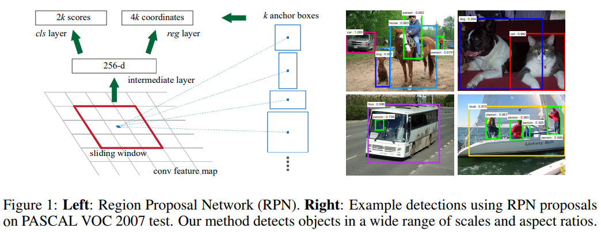
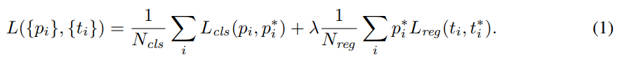
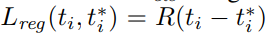
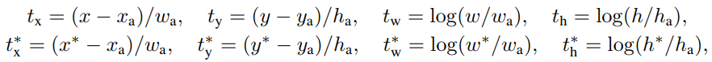

<b>Faster RCNN</b>

论文：[Faster R-CNN: Towards Real-Time Object Detection with Region Proposal Networks](resource/FasterRCNN/FasterRCNN.pdf)  
代码：https://github.com/ShaoqingRen/faster_rcnn  

* [摘要](#abstract)
* [1、介绍](#introduction)
* [2、相关工作](#related)
* [3、区域候选网络](#rpn)
  * [平移不变锚点](#anchors)
  * [学习区域提议的损失函数](#loss)
  * [优化](#optimization)
  * [区域提议和目标检测共享卷积特征](#sharing_conv_features)

<b>摘要</b>

之前的目标检测网络像SPPnet[7] 和 Fast RCNN[5] 减少了检测网络的耗时， **候选区域的生成成为整体检测速度的瓶颈** 。本篇引入了 区域候选网络(RPN)， **RPN 和检测网络共享整个图片的卷积特征，这使得生成候选区域几乎不消耗时间** 。RPN 是一个全卷积网络，同时预测物体区域和每个位置的物体得分。RPN 通过端到端的训练去生成高质量的候选区域，然后候选区域给 Fast R-CNN做检测（这么说，Faster R-CNN 在结构上就是 RPN + Fast R-CNN）。通过简单的交替优化，RPN 和 Fast R-CNN 可以被训练为共享卷积特征。对于非常深的 VGG-16 模型[19]，我们的检测系统在单GPU上的速度是5fps，在 PASCAL VOC 2007(73.2% mAP) 和 2012(70.4% mAP) 上，每张图片使用300个候选区域，达到了 state-of-the art 的目标检测准确率。  
>候选区域生成过程成为了目标检测过程的速度瓶颈，本文提出了和检测网络共享卷积特征的区域候选网络RPN。  

<b>1、介绍</b>

近来先进的目标检测方法由区域候选方法（比如[22]）和基于区域的卷积网络（R-CNN）[6] 驱动。虽然基于区域的CNN就像R-CNN一样计算量比较大，它们的计算量荣国候选区域共享卷积被大幅度地减少。最近的 Fast R-CNN[5]在忽略生成候选区域的时间前提下，使用很深的网络[19]达到了将近实时的速度。现在，**候选区域是 state-of-the-art 检测系统的计算瓶颈**。  

区域候选方法通常依赖于廉价的特征和经济的推理方案。选择性搜索(SS)[22]，最流行的方法之一，它基于工程化的低级特征贪婪地合并超像素。和有效的检测网络Fast R-CNN[5]相比，选择性搜索慢了一个数量级，CPU上面一张图片耗时2秒。EdgeBoxes[24]在质量和速度之间提供了很好的平衡，0.2秒一张图片。然而，区域候选步骤仍然消耗和检测网络一样多的时间。  

可以注意到，快速的基于区域的CNN发挥了GPU的优势，然而研究中用的区域候选方法是在CPU上实现的，这样的运行时间比较是不公平的。一个很直接打的加速候选计算的方法是在GPU上重新实现。这可能是一个有效的工程方案，但是重新实现忽略了下游网络，因此不能共享计算。  

在本篇论文中，我们展示了一个算法上的改变——使用深度网络计算候选区域——这是一个优雅而有效的解决方案，候选计算在检测网络的计算下基本是无成本的。为此，我们引入了新颖的区域候选网络（RPNs），它与state-of-the-art的目标检测网络[7,5]共享卷积层。通过在测试时共享卷积，计算候选区域的边际成本很低（比如，10ms每张图片）。  

我们的观察结果是基于区域的检测器像Fast R-CNN，使用的卷积特征，也可以用来生成候选区域。在这些特征的基础上，我们增加两个额外的卷积层构造RPN：一个卷积层将卷积图位置编码为一个短的（比如，256维）特征向量，另一个卷积层，在每个卷积图位置输出一个物体分数和那个位置的与各种尺度和宽高比相关的k（k一般取9）个候选区域的回归框。  

我们的RPN是一种全卷积（FCN）[14]网络，可以针对生成候选区域的任务进行端到端训练。为了将RPN于Fast R-CNN[5]目标检测网络统一起来，我们提出了一个简单的训练机制，保证候选区域不变，在区域候选任务调优和目标检测调优之间交替。这个机制收敛很快，并且产生了一个在两个任务间共享卷积特征的统一的网络。  

>总结：候选区域生成过程是目标检测过程的速度瓶颈，本文提出了RPN。通过交替调优训练RPN和检测网络，使得它和检测网络共享卷积特征，几乎不增加额外的开销。它只是在卷积特征的基础上加上了两个卷积层。  
>作者好啰嗦。。。  

<b>2、相关工作</b>

近来有几篇论文提出了一些使用深度网络定位类别相关或类别无关的回归框的方法[21,18,3,20]。在OverFeat[18]中，使用一个全连接层预测单目标的box坐标。在检测多个类别相关的目标时这个全连接层被换成了一个卷积层。MulltiBox方法[3,20]使用网络生成候选区域，这个网络的最后一个全连接层同时预测多个box（比如，800），被用于R-CNN[6]中。他们的候选网络用于单图片或者多个大剪切图片（比如224x224）。我们将和我们的方法一起深入讨论OverFeat和MultiBox。  

共享卷积计算[18,7,2,5]由于在计算机视觉方面的效率和速度已经引起越来越多的关注。OverFeat论文[18]通过图像金字塔计算卷积特征用于分类，定位和检测。共享卷积特的尺寸自适应池化(SPP)[7]被提出用于高效的基于区域的目标检测[7,16]和语义分割[2]。Fast R-CNN[5]可以在共享卷积特征上面端到端训练检测器，展示出了准确率和速度。
>相关的工作显示出共享卷积计算的强大。  

<b>3、区域候选网络</b>

RPN以一张任意大小的图片为输入，输出一组矩形候选框，每一个都带有物体分数。我们将这个过程建模为全卷积网络[14]。因为我们的终极目标是和Fast R-CNN目标检测网络[5]共享计算，我们假定这两个网络共享卷积层。在我们的实验中，我们调查了 Zeiler 和 Fergus 模型[23](ZF)，这个模型有5个可共享的卷积层，以及 Simonyan 和 Zisserman的模型[19](VGG)，有13个可共享的卷积层。  

  

为了生成候选区域，我们放一个小网络在最后一个卷积层输出的特征图上滑动。这个网络全连接到输入特征图上的 $n\times n$ 窗口。每个滑动窗口被映射为一个低维向量（ZF是256维，VGG是512维）。这个向量被送入两个并列全连接层——一个box回归层(reg)和一个box分类层（cls）。本论文中我们使用 n=3,注意到输入图像的有效感受域很大（ZF和VGG分别是171和228像素）。这个微型网络如图1（左侧）所示。注意由于微型网络以滑动窗口方式运行，全连接层在所有的空间位置共享（the fully-connected layers are shared across all spatial locations）。这个架构自然地使用一个$n\times n$的卷积层后加两个并列 $1\times 1$卷积层（分别用于回归和分类）实现。$n\times n$卷积层的输出后用ReLUs[15]。  
>这段的给出了RPN的结构，如图1左侧。中间的全连接层在空间位置上是共享的，这个还不明白，是窗口之间有重叠所以有共享吗？

<b>平移不变锚点</b>

在每一个滑动窗口位置，我们同时预测 k 个候选区域，因此回归层有 4k 个输出编码 k 个 box 的坐标。分类层输出 2k 个分数估计每一个候选区域有目标、没有目标的概率。这 k 个候选区域用 k 个相关的参考框参数化，叫做锚点。每个锚点都在所讨论的滑动窗口的中心，并且与尺寸和宽高比相关。我们使用 3 个尺寸和 3 个宽高比，在每个滑动位置产生 k=9 个锚点。对于一个大小为 $W \times H$（大约是2400）的卷积特征图，共产生 $WHk$个锚点。我们的方法的一个重要特性在于它具有平移不变性，锚点和计算锚点对应的候选框的函数都具有平移不变性。  

比较一下，MultiBox 方法[20]使用 k-means 生成800个锚点，这些锚点不具有平移不变性。如果平移图片中的一个目标，候选区域应该平移并且同样的函数应该能够在任一位置预测这个候选区域。此外，由于MultiBox锚点不具有平移不变性，它需要 (4+1)x800 维度的输出层，而我们的方法只需要 (4+2)x9 维度的输出层。我们提出的层有更小数量级的参数量（MultiBox使用 GoogLeNet[20]有27百万的参数 vs RPN使用VGG-16有2.4百万的参数），因此在像PASCAL  VOC的小数据集上过拟合的风险更低。  
>总结：RPN的回归层有4k个输出，k个候选区域，每个区域4个值。分类层有2k个输出，每个候选区域有两个概率，有目标、没有目标的概率。k个候选区域对应k个锚点。k一般是9。锚点和计算锚点对应的候选框的函数都具有平移不变性。  

<b>学习区域提议的损失函数</b>

为了训练RPN，我们给每个锚点设置二分类标签（是或者不是一个目标）。我们给两类锚点设置正类标签：(i)和一个ground-truth box的交并比(IoU)最高的锚点。(ii)与任何一个ground-truth box的IoU超过0.7的锚点。注意一个ground-truth box可能用来给多个锚点设置正类标签。如果一个非正类锚点和所有的ground-truth boxex的 IoU 都低于 0.3 ，就把这个锚点设置负类标签。不是正类也不是负类的锚点不会加入训练。  

参考Fast R-CNN中的多任务损失函数，我们的损失函数定义为：
  

$i$是mini-batch中锚点的索引，$p_i$是预测锚点$i$是目标的概率。如果锚点是正类的，ground-truth 标签 $p^*_i$是1，如果锚点是负类，$p^*_i$就是0。$t_i$是预测的bbox的4个参数化的坐标组成的向量，$t^*_i$是与一个正类锚点相关的ground-truth box。分类损失$L_{cls}$是两个类别（目标vs非目标）的对数损失。对于回归损失，我们用  
  
其中$R$是定义在[5]中的鲁棒损失函数（smooth L1）。$p_{i}^{*} \boldsymbol{L}_{r e g}$表示回归损失只对正类锚点（$p^*_i = 1$）是激活的，否则（$p^*_i=0$）就是不激活的。分类层和回归层的输出分别包含 $\left\{p_{i}\right\}$ 和 $\left\{t_{i}\right\}$ 。这两项损失由$N_{c l s}$ 和 $N_{r e g}$ 归一化，使用平衡权重$\lambda$平衡两个损失。  

对于回归，四个坐标的参数化如下[6]：  
  

其中，$x,y,w $和$h$分别表示box的中心两个坐标，宽和高。变量$x,x_a$和$x^*$分别属于预测box,锚点box，和ground-truth box（$y,w,h$也一样）。这可以被看作是从锚点box到附近的ground-truth box的边界框（bounding-box）回归。  

我们的边界框回归方法和之前的基于特征图的方法[7,5]不同。在[7,5]中，边界框回归在任意大小的区域池化后的特征上进行，回归权重有所有的区域大小共享。在我们的方程中，用于回归的特征来自同样空间大小（$n \times n$）的特征图。为了处理不同的尺寸，学习 k 个边界框回归器。每个回归器负责一个尺度和一个宽高比，k 个回归器不共享权重。如此，预测不同大小的boxes是可能的，即使特征是固定的尺寸。
>总结：正例：与某个gt的 IoU最大的锚点和与任何一个gt的IoU超过0.7的锚点。负例：与所有gt的IoU低于0.3的非正例锚点。  
>损失函数  
>k 个回归器不共享权重分别负责不同的尺寸宽高比组合。  
>为什么$t_x,t_y,t_w,t_h$是这样的形式？  
>分析：1、因为不同锚点、ground-truth之间的宽高差异可能比较大，所以除以 $w_a$或$h_a$消除这个差异的影响。  
2、那为什么 $t_w$和$t_h$要取对数？因为从回归损失$L_{reg}$的形式来看，$t_x,t_y,t_w,t_h$占同样的权重，如果$t_w$取$w / w_{\mathrm{a}}$的形式，就和$t_x$不在一个数量级（应该会比$t_x$大一个数量级，在接近收敛的时候$x$和$x_a$不应该会差太多）。取对数之后就会让$t_w$和$t_x$更接近。  

<b>优化</b>

使用全卷积网络[14]实现的RPN，可以通过反向传播和随机梯度下降[12]端到端地训练。我们按照Fast R-CNN[5]中的 "image-centric"抽样策略训练网络（Fast R-CNN中是两张图片再加上每张图片64个候选区域）。每个mini-batch由包含许多正类和负类锚点的单张图片组成。优化所有锚点的损失函数是可能的，但是这会导致偏向负例，因为负例占主导。相反，我们从一张图片中随机抽取256个锚点去计算一个mini-batch的损失，其中正例锚点和负例锚点的比例为1:1。如果某张图片的正例锚点数量不足128，用负例锚点补充。  

使用零均值标准差为0.01的高斯分布初始化所有新层的权重。所有其他层（即共享卷积层）使用预训练的ImageNet分类[17]模型初始化，这是标准实践[6]。我们调整ZF net的所有层，以及VGG net的conv3_1和上面的层以节省内存[5]。我们使用0.001的学习率训练60k个mini-batch，使用0.0001的学习率训练后面来自PASCAL数据集的20k个mini-batch。我们也使用了0.9的动量和0.0005的权重衰减[11]。用Caffe[10]实现。  
>总结：训练数据分为两部分 60k + 20k(PASCAL)，使用不同的学习率。每个mini-batch由一张图片+128个正例锚点+128个负例锚点组成。

<b>区域提议和目标检测共享卷积特征</b>

至此，我们已经描述了 在不考虑基于区域的目标检测CNN对候选区域的使用的情况下 如何训练一个区域提议生成网络。对于检测网络，我们使用Fast R-CNN[5]，现在描述在RPN和Fast R-CNN之间共享卷积层的学习算法。  

RPN和Fast R-CNN都是单独训练的，它们会以不同的方式更新卷积层。因此我们需要一种技术在两个网络间共享卷积层，而不是学习两个分离的网络。注意这并不是像简单地定义一个包含RPN和Fast R-CNN的网络，然后使用反向传播联合优化那么容易。因为Fast R-CNN基于固定的目标候选区域训练，并且并不清楚在学习Fast R-CNN的同时改变区域提议机制是否会收敛。这个联合优化将会是一个有趣的问题，我们开发了实用的四步训练算法通过交替优化去学习共享特征。  

第一步，我们按照上面的方式训练RPN。这个网络由一个预训练的ImageNet模型初始化，然后在区域提议任务上端到端调优。第二步，我们使用第一步的RPN生成候选区域训练一个分离的检测网络Fast R-CNN。检测网络也由ImageNet预训练模型初始化。到这一步，这两个网络没有共享卷积层。第三步，使用检测网络初始化RPN训练，但是固定共享卷积层并且只调优RPN特有的层。现在两个网络共享了卷积层。第四步，保持共享卷积层固定，调优Fast R-CNN的全连接层。如此，两个网络共享卷积层，并且形成了一个统一的网络。  
>总结：学习共享卷积特征的四步训练法，先独立训练再交替调优。
