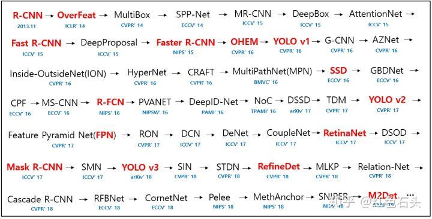

###目标检测综述

&emsp;&emsp;目标检测的目的是找出图像或视频中感兴趣的物体并给出位置和大小，是机器视觉领域的核心问题之一。这里的目标检测指多目标检测，像人脸检测等单目标检测算法不在此列。
&emsp;&emsp;目标检测算法按照阶段可以分为 One Stage 和 Two Stage。Two Stage 算法的代表为RCNN系列，One stage 算法的代表有YOLO，SSD等。
&emsp;&emsp;Two Stage 算法分为提取候选区域和候选区域分类两个阶段。One Stage算法并不预先提取候选区域，而是直接回归产生候选区域，然后对该区域进行分类。通常 One Stage 算法要比 Two Stage 算法快。

&emsp;&emsp;下图是2013年末到2014年的CNN目标检测模型列表，红色部分是图片作者建议必读论文。

抽出一些经典的模型:
* 2013 RCNN
* 2014 OverFeat、SPPNet
* 2015 Fast RCNN、
* 2016 Faster RCNN、YOLO、SSD、R-FCN
* 2017 YOLO2、FPN、Mask RCNN
* 2018 YOLO3 

