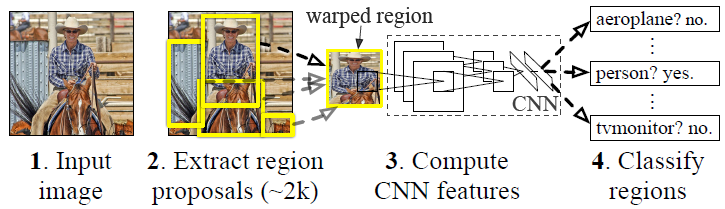
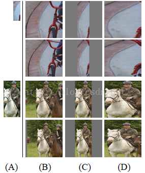
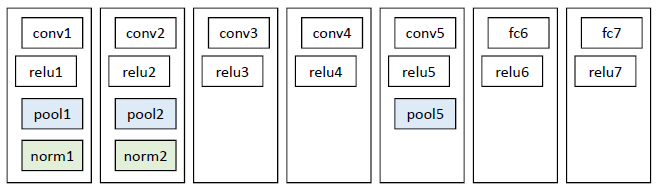

 <b> Region-based Convolutional Neural Networks</b> 

[Region-based Convolutional Networksfor Accurate Object Detection and Segmentation](resource/RCNN/RCNN.pdf)

RCNN是2013年提出的一个目标检测算法，是将CNN引入目标检测的开山之作，引导了深度学习在目标检测领域的思路。

RCNN相对于之前方法的主要改进（之前只有传统方法）：
* 1、使用Selective Search提取候选区域，相对于之前的滑窗法在速度上有提升。
* 2、使用CNN提取特征，相对于传统的Haar，HOG特征，可以少受人们知识经验的局限。
  
RCNN使用了两个数据集：
* 一个较大的识别库（ImageNet ILSVC 2012）：标定每张图片中物体的类别。一千万图像，1000类。 
* 一个较小的检测库（PASCAL VOC 2007）：标定每张图片中，物体的类别和位置。一万图像，20类。 
先使用识别库进行预训练，而后用检测库调优参数。最后在检测库上评测。

RCNN的检测流程:
* [提取候选区域](#title-1)
* [用CNN对候选区域提取特征](#title-2)
* [用SVM对特征分类](title-3)
* [用回归器对检测框精修](#title-4)
  

<b>一、候选区域生成</b>

RCNN首先使用Selective Search从一张图像中选出2K~3K个候选区域。
思想如下:
* 1、使用一分割方法，将图像分割成小区域
* 2、使用一种合并规则，合并可能性最高的两个区域。重复直到整张图片合并成一个区域。
* 3、输出所有存在过的区域为候选区域

这里不限定使用何种分割算法。关于合并需要注意的是要避免一个大区域连续“吃掉”其它小区域。例：设有区域a-b-c-d-e-f-g-h。较好的合并方式是：ab-cd-ef-gh -> abcd-efgh -> abcdefgh。 不好的合并方法是：ab-c-d-e-f-g-h ->abcd-e-f-g-h ->abcdef-gh -> abcdefgh。

为尽可能不遗漏候选区域，上述操作在多个颜色空间中同时进行（RGB,HSV,Lab等）。在一个颜色空间中，使用不同的规则组合进行合并。

关于Selective Search，详见[Selective Search](Selective-Search.md#Selective-Search)

<b>二、用CNN对候选区域提取特征</b>

* **1、预处理**
  先把候选区域resize成227x227。论文实验了两种不同的resize方式：
  (1)、各向异性缩放
  不考虑图像的宽高比例直接缩放，缩放效果如下图(D)。
  (2)、各向同性缩放
  因为图片扭曲后可能会对后续CNN的精度有影响，所以作者测试了多种方案。有两种方案如下：
  (a)直接在原图中，把候选区域扩展延伸成正方形再进行缩放。如果延伸超出了原图，就用候选区域中的像素均值进行填充,如下图(B)。
  (b)先把候选区域裁剪出来，然后用固定的背景颜色填充成正方形（背景颜色也是用候选区域的颜色均值），如下图(C)。
  

* **2、预训练**
  网络结构：
  这个过程其实就是迁移学习,可以提高精度,减少对检测数据的数据量需求。网络结构是基本借鉴Hinton 2012年在Image Net上的分类网络Alexnet，略作简化。此网络提取的特征为4096维，之后送入一个4096->1000的全连接(fc)层进行分类。网络结构如下：
  
  数据：
  使用ILVCR 2012的全部数据进行训练，输入一张图片，输出1000维的类别标号，学习率0.01。
* **3、调优训练**
  网络结构：
  将上述网路的最后一层换成4096->21的全连接层。学习率0.001，每一个batch包含32个正样本（属于20类）和96个背景。
  数据：
  使用PASCAL VOC 2007的训练集，输入一张图片，输出21维的类别标号，表示20类+背景。 
  考察一个候选框和当前图像上所有标定框重叠面积最大的一个，如果重叠比例大于0.5，则认为此候选框为此标定的类别；否则认为此候选框为背景。

<b>三、用SVM对特征分类</b>

  * 分类器：
  对每一类目标，使用一个线性SVM二类分类器进行判别，共有21个SVM分类器。输入为深度网络输出的4096维特征，输出是否属于此类。这里的详细过程为：当我们用CNN提取2000个候选框，可以得到2000*4096这样的特征向量矩阵，然后我们只需要把这样的一个矩阵与svm权值矩阵4096*N矩阵乘，得到2000*N的矩阵，就是每一个类对2000个候选框的打分，N为分类类别数目，就可以得到结果了。
  然后再对每个类别的分类框进行非极大值抑制（NMS），去除重叠过多的框。关于非极大值抑制，详见[非极大值抑制](NMS.md#NMS)
  * 正样本
  本类的真值标定框。 
  * 负样本
  考察每一个候选框，如果和本类所有标定框的重叠都小于0.3，认定其为负样本。由于负样本很多，使用hard negative mining方法。 

<b>四、用回归器对检测框精修</b>

候选区域的可能不够准确， 用线性脊回归器对其进行精修。
* 回归器
  对于每个类别，使用一个线性脊回归器。正则项 $ \lambda = 10000$。
* 输入和输出
CNN 中 pool5层的4096维特征，输出为x,y方向的缩放和平移。
* 训练样本
  判定为本类的候选框中，和真值重叠面积大于0.6的候选框。

**结果**
论文发表的2014年，DPM已经进入瓶颈期，即使使用复杂的特征和结构得到的提升也十分有限。本文将深度学习引入检测领域，一举将PASCAL VOC上的检测率从35.1%提升到53.7%。 
本文的前两个步骤（候选区域提取+特征提取）与待检测类别无关，可以在不同类之间共用。这两步在GPU上约需13秒。 
同时检测多类时，需要倍增的只有后两步骤（判别+精修），都是简单的线性运算，速度很快。这两步对于100K类别只需10秒。

**代码实现**
https://github.com/rbgirshick/rcnn 

**思考**

为什么不直接用CNN对候选区域进行分类而要用SVM？

**参考**
[1] Region-based Convolutional Networksfor Accurate Object Detection and Segmentation
[2] https://www.cnblogs.com/zyber/p/6672144.html
[3] https://blog.csdn.net/shenxiaolu1984/article/details/51066975
[4] https://www.baidu.com/link?url=G2-kNDnSnaY4K9ElGqY2sFdtm-p-gDtBbj7sYiE-OO5HtGIN1i7HSvZgBOSyTo4S&wd=&eqid=c161182a0003cf66000000025cd621bd